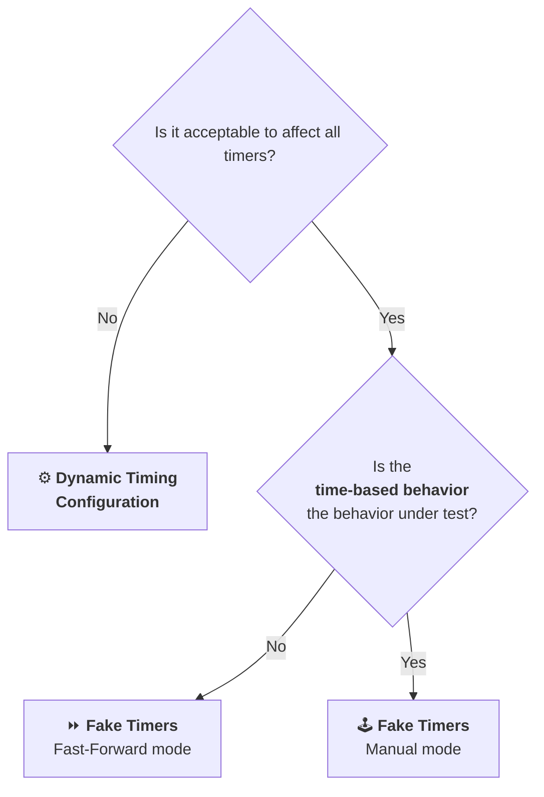

import { DocLinkCard } from '@site/src/components/doc-link-card';
import { MegaQuote } from '@site/src/components/mega-quote';

Components often have legitimate reasons to rely on time-based behavior:

- _Debouncing or throttling user input_
- _Delaying UI feedback: toast auto-dismiss, loading state minimum duration, etc._
- _Polling_
- _Countdowns_
- _Animations and visual effects_
- _Different behavior depending on the current date and time_
- _etc._

But when it comes to testing, you'll typically face one of two scenarios:

[**The timing is the behavior under test**](#testing-the-time-based-behavior-itself) — you want to verify that a debounce waits the right amount of time or that a toast disappears after 5 seconds.

[**The timing is just in the way**](#testing-despite-the-time-based-behavior) — the feature you are testing happens to involve a timer, but the timing itself is not what you are verifying. You just need it to get out of the way.

## Testing the Time-based Behavior Itself

When the timing **is** the behavior you're testing — _"does the debounce wait 300ms before emitting?"_ or _"does the toast dismiss after 5 seconds?"_ — you need a way to assert what happens at specific points in time.

The two most common approaches for this are:

- [Fake Timers in "Manual" Mode](#fake-timers-in-manual-mode)
- and [Dynamic Timing Configuration](#dynamic-timing-configuration-time-behavior)

### Fake Timers in "Manual" Mode

Most testing frameworks provide a way to [monkey patch](/angular/testing/glossary#monkey-patch) the global clock with fake timers.

Vitest is no exception and provides a [`vi.useFakeTimers()`](https://vitest.dev/guide/mocking/timers) method which installs a fake clock that intercepts calls to `setTimeout`, `setInterval`, `requestAnimationFrame`, `Date.now`, etc. _(It is internally powered by the `@sinonjs/fake-timers` library)_

:::info Default behavior of Vitest fake timers is "manual" mode
The default behavior of Vitest fake timers is to pause all timers unless you manually advance the time.
:::

In this mode, time stands still until you explicitly advance it using methods like `vi.advanceTimersByTimeAsync()`. This gives you the ability to assert conditions at precise points in time — _"at 290ms, the debounce has not fired; at 310ms, it has."_

:::warning Side effects of fake timers
A major side effect of using fake timers with "manual" mode is that it will pause **all** timers — including Angular's internal scheduling. This means Angular can't process change detection, resolve promises, or update the DOM until you advance time.

An example is the following test which will time out because Angular's internal synchronization timers are never triggered. Thus, Angular can't become stable.

<div className="bad">

```ts
it('waits for stability forever', async () => {
  vi.useFakeTimers();

  const fixture = TestBed.createComponent(Greetings);

  await fixture.whenStable(); // ❌ This will never resolve and the test will timeout.
});
```

</div>

To work around this, you must call `vi.runAllTimersAsync()` after creating the component to flush Angular's synchronization timers before interacting with it.

:::

Assuming that we want to test that the form's submit button is disabled while waiting for a **300ms debounce** to finish, we can proceed like this:

<div className="good">

```ts
import { onTestFinished } from 'vitest';

it('disables submit button while waiting for debounce', async () => {
  vi.useFakeTimers();
  onTestFinished(() => {
    vi.useRealTimers();
  });

  TestBed.createComponent(CookbookForm);

  await vi.runAllTimersAsync();

  // ... fill the form ...

  // highlight-start
  // Advance by 290ms (debounce duration - 10ms).
  // 🤔 why 10ms and not 1ms? See "Time is Not a Precise Science" section.
  await vi.advanceTimersByTimeAsync(290);
  // highlight-end

  // The button is disabled because the debounce is still pending.
  await expect
    .element(page.getByRole('button', { name: 'Submit' }))
    .toBeDisabled();
});
```

</div>

### Dynamic Timing Configuration {#dynamic-timing-configuration-time-behavior}

Another approach is to use dynamic configuration through dependency injection to override the time durations from your tests instead of hardcoding them.

<div className="good">

```ts title="form-timing.config.ts"
@Injectable({ providedIn: 'root' })
export class FormsTimingConfig {
  datepickerDebounce = 1_000;
  inputDebounce = 300;
}

export function provideFormsTimingConfig(
  config: FormsTimingConfig,
): Provider[] {
  return [{ provide: FormsTimingConfig, useValue: config }];
}

const MAX_TIMEOUT = Math.pow(2, 31) - 1;
export function provideTestingFormsTimingConfig(
  mode: 'instant-debounce' | 'never-ending-debounce',
) {
  const debounce = mode === 'instant-debounce' ? 0 : MAX_TIMEOUT;
  return provideFormsTimingConfig({
    datepickerDebounce: debounce,
    inputDebounce: debounce,
  });
}
```

</div>

With this approach, tests can set durations to `0` _(instant)_ or `MAX_TIMEOUT` _(never fires)_ to verify that something fires _"eventually"_ or _"never"_ — without relying on exact timing and without intercepting any timers. Angular's internal scheduling runs normally, and there is no risk of side effects on other timers.

<div className="good">

```ts
it('disables submit button while waiting for debounce', async () => {
  TestBed.configureTestingModule({
    // highlight-next-line
    providers: [provideTestingFormsTimingConfig('never-ending-debounce')],
  });

  // ... create component and fill the form ...

  await expect
    .element(page.getByRole('button', { name: 'Submit' }))
    .toBeDisabled();
});

it('enables submit button after debounce', async () => {
  TestBed.configureTestingModule({
    // highlight-next-line
    providers: [provideTestingFormsTimingConfig('instant-debounce')],
  });

  // ... create component and fill the form ...

  await expect
    .element(page.getByRole('button', { name: 'Submit' }))
    .toBeEnabled();
});
```

</div>

## Testing Despite the Time-based Behavior

Once the time-based behavior is tested thoroughly enough, you will probably write tests that focus on other behaviors of the exercised code.
As these tests do not care about the time-based behavior itself, they should not be affected by it.

<MegaQuote>Tests should be [composable](/angular/testing/glossary#composable).</MegaQuote>

### Fake Timers in "Fast-Forward" Mode

The problem with using fake timers in "manual" mode is that it couples the test to the time-based behavior.
What if there was a fake timers mode that would advance time on its own, only as fast as needed?

Well, [Andrew Scott](https://github.com/atscott) from the Angular Team put effort into adding this feature to many testing tools out there:

- Jasmine [PR#2042](https://github.com/jasmine/jasmine/pull/2042)
- Sinon.JS [PR#509](https://github.com/sinonjs/fake-timers/pull/509)
- Vitest [PR#8726](https://github.com/vitest-dev/vitest/pull/8726)

_Thank you, Andrew! ❤️_

In Vitest, you can enable the "fast-forward" mode by calling [`vi.setTimerTickMode('nextTimerAsync')`](https://main.vitest.dev/api/vi.html#vi-settimertickmode).

:::info

`vi.setTimerTickMode('nextTimerAsync')` is available since Vitest 4.1.0.

:::

In this mode, whenever a macrotask is scheduled _(e.g. via `setTimeout`)_, the fake clock automatically advances time by the necessary amount and flushes the microtasks queue. Delays are skipped instantly — **without** requiring you to manually advance time or know the exact durations.

:::info `nextTimerAsync` is not synchronous
While "automatically" might suggest that time advances synchronously, it doesn't. Hence the name of the tick mode.

When you call `setTimeout` in your test, the fake clock schedules a real macrotask internally to fast-forward time — so the advance hasn't happened yet on the very next line.

<details>
<summary>🔬 Under the hood (safe to skip)</summary>

```ts
it('fast-forwards time in a macrotask', async () => {
  const realTimeout = setTimeout;
  const waitForReal = (d: number) => new Promise((r) => realTimeout(r, d));

  // Schedules the macrotask loop that will fast-forward time.
  vi.useFakeTimers().setTimerTickMode('nextTimerAsync');

  const start = Date.now();

  // Fake timer is aware of this timer but not flushing it yet.
  setTimeout(() => {}, 1_000_000);

  // Therefore fake time did not advance yet.
  expect(Date.now() - start).toBe(0);

  // By scheduling our own macrotask, we give the chance to the fake timer to flush.
  // It flushes each timer — and the microtask queue — in chronological order.
  // We wait 1ms because `nextTimerAsync` actually schedules an extra
  // macrotask to flush the microtask queue.
  await waitForReal(1);

  // All timers have been flushed and the time has advanced.
  expect(Date.now() - start).toBe(1_000_000);
});
```

💻 Here is the [relevant code](https://github.com/sinonjs/fake-timers/blob/dcfd1bd885fbf02ff44601b36cd9614aa67288e2/src/fake-timers-src.js#L1263) in `@sinonjs/fake-timers` where the magic happens.

</details>
:::

```ts
it('fast-forwards time', async () => {
  vi.useFakeTimers().setTimerTickMode('nextTimerAsync');

  const start = Date.now();
  // This would take an hour with real timers,
  // but resolves instantly with fast-forward.
  await new Promise((resolve) => setTimeout(resolve, 3_600_000));
  expect(Date.now() - start).toBe(3_600_000);
});
```

Thanks to "fast-forward" mode, you can:

- write tests that focus on other behaviors regardless of any timing-related details such as the debounce,
- make your tests faster than they would be with real timers.

### Dynamic Timing Configuration {#dynamic-timing-configuration-skip-time-behavior}

In most cases, allowing tests to [configure the timing](#dynamic-timing-configuration-time-behavior) is enough. Setting all durations to `0` _(instant)_ makes timing transparent without needing fake timers at all.

:::tip Real-life example
An example of this approach is Angular Material's [`MATERIAL_ANIMATIONS` injection token](https://github.com/angular/components/blob/b09504802e3fa27793ff2ef86d7e62fe22b67c7c/src/material/chips/chip-input.spec.ts#L33) which allows you to disable animations for testing purposes.
:::

## Understanding Fake Timer Behavior

Whether you use fake timers in [manual](#fake-timers-in-manual-mode) or [fast-forward](#fake-timers-in-fast-forward-mode) mode, there are a few important things to understand about how they work.

### Time is Not a Precise Science

Timing is inherently imprecise with real timers — many factors can affect it. You might expect fake timers to be perfectly precise, but in practice, they aren't.

For example, when a timer is scheduled within a timer callback, `@sinonjs/fake-timers` will add an additional millisecond. _(Cf. [docs](https://github.com/sinonjs/fake-timers#:~:text=If%20called%20during%20a%20tick%20the%20callback%20won%27t%20fire%20until%201%20millisecond%20has%20ticked%20by), [code](https://github.com/sinonjs/fake-timers/blob/341203310225bf5cd3d7396b2fcf276c5e218347/src/fake-timers-src.js#L645C58-L645C68))_

```ts
it('adds an additional millisecond when a timer is scheduled within a timer callback', async () => {
  vi.useFakeTimers();

  setTimeout(() => {
    console.log('first timeout called');
    setTimeout(() => {
      console.log('second timeout called');
    }, 0);
  }, 0);

  const start = Date.now();
  await vi.advanceTimersByTimeAsync(0); // logs "first timeout called"
  await vi.advanceTimersByTimeAsync(0); // does not log anything
  await vi.advanceTimersByTimeAsync(1); // logs "second timeout called"
  expect(Date.now() - start).toBe(1);
});
```

Therefore, when using fake timers, you should approximate the time rather than using precise values. Otherwise, tests can be brittle and [structure-sensitive](/angular/testing/glossary#structure-insensitive).
In other words, nesting timers should not break your tests.

### Restoring Real Timers

Fake timers are global — if not cleaned up, they leak into subsequent tests. Always restore real timers when the test finishes.

Use Vitest's [`onTestFinished`](https://vitest.dev/api/#ontestfinished) hook to keep setup and teardown colocated.
This ensures that real timers are restored whether the test passes or fails, without harming readability and maintainability with `beforeEach` and `afterEach`.

```ts
import { onTestFinished } from 'vitest';

function setUpFakeTimers() {
  vi.useFakeTimers();
  onTestFinished(() => {
    vi.useRealTimers();
  });
}
```

### Async Over Sync

You might notice synchronous versions of fake timers methods such as `vi.advanceTimersByTime` and `vi.runAllTimers`.

Unless you **really** know what you are doing, like testing your own framework's internal scheduling engine, you should always use the async versions such as `vi.advanceTimersByTimeAsync` and `vi.runAllTimersAsync`.

The async versions produce a behavior that is more [symmetric to production](/angular/testing/glossary#symmetric-to-production) because they flush the microtasks queue while the synchronous versions can produce a behavior that is impossible with real timers.

### Do Not Install Fake Timers in the Middle of the Test

Fake timers must be installed **before** any component creation or timer-dependent code runs. Mixing real timers with fake timers is a recipe for disaster.

<div className="bad">

```ts
it('disables submit button while waiting for debounce', async () => {
  TestBed.createComponent(CookbookForm);

  vi.useFakeTimers(); // ❌ Timers triggered by the component creation will not be intercepted.

  ...
});
```

</div>

## ⚖️ Trade-offs

|                                  | 👍 Pros                                                                                                                                                                       | 👎 Cons                                                                                                                                                               |
| -------------------------------- | ----------------------------------------------------------------------------------------------------------------------------------------------------------------------------- | --------------------------------------------------------------------------------------------------------------------------------------------------------------------- |
| **Fake Timers**                  | Full control.                                                                                                                                                                 | Side effects like breaking Angular internals if not used carefully.                                                                                                   |
| **Dynamic Timing Configuration** | No interference with other timers such as Angular's scheduling.<br />Testing-framework agnostic. _(All my thoughts go for those who've been bitten by Angular's `fakeAsync`)_ | Can cause things to run in different order than production.<br /><i>e.g. A form's auto-save and debounce durations order difference between tests and production.</i> |

## Zone.js vs. Zoneless

<MegaQuote>Vitest's fake timers are the Zone-agnostic way to control time in tests. This is also a transportable skill that you can reuse beyond Angular.</MegaQuote>

Since Angular 21, [Zoneless](https://angular.dev/guide/zoneless) mode is the default behavior. However, as I advocate for in my [Pragmatic Angular Testing course](https://courses.marmicode.io/), even if your app is still Zone-based, or using an older Angular version, **I highly recommend writing Zoneless-ready tests**. That is why everything described in this chapter is Zoneless-ready.

If your tests work with Zoneless mode, you can be confident that they will work with Zone-based mode as well. This helps you stay future-proof and easily switch to Zoneless when the time is right for you.

If for some reason, the exercised code relies on Zone.js, then you should turn on automatic synchronization and make the test behavior more symmetric to production:

```ts
TestBed.configureTestingModule({
  providers: [{ provide: ComponentFixtureAutoDetect, useValue: true }],
});
```

:::info `ComponentFixtureAutoDetect` vs. `fixture.autoDetectChanges()`
`ComponentFixtureAutoDetect` is similar to calling `fixture.autoDetectChanges()` but the dependency injection configuration provides a better developer experience as it is easier to factor out.

_⚠️ You do **not** need either of these two if you are writing a Zoneless test._
:::

## Decision Tree



:::tip
While there are valid use cases of switching the tick mode between `manual` and `nextTimerAsync` ("fast-forward" mode) during a test, I would recommend sticking to one mode per test to reduce the cognitive load for both humans and agents.
:::

## Key Takeaways

- ⏱️ **Identify your goal first**: is the time-based behavior the thing you are testing, or is it just in the way?
- 🕹️ **Use fake timers in "manual" mode** when you need to assert precise timing behavior such as debounce or auto-dismiss.
- ⏩ **Use fake timers in "fast-forward" mode** when the timing is irrelevant and you just need it out of the way.
- ⚙️ **Use dynamic timing configuration** when you want to avoid fake timers' side effects on other timers.
- 🔁 **Always restore real timers** with `onTestFinished` to avoid leaking fake timers across tests.
- 🎯 **Approximate time, don't match it exactly** — nested timers add extra milliseconds. Brittle assertions on precise time make tests [structure-sensitive](/angular/testing/glossary#structure-insensitive).
- 🧩 **Stick to one approach per test** to keep the cognitive load low for both humans and agents.

## Additional Resources

- 📝 [**Handling Time and Mock Clocks in Tests** by Andrew Scott (2025)](https://blog.angular.dev/handling-time-and-mock-clocks-in-tests-5a393b32dd30)
- 📝 [**Future of fake timer testing in a zoneless world** GitHub issue by Younes Jaaidi (2024)](https://github.com/angular/angular/issues/55295)

## 🍳 Related Recipes

<DocLinkCard docId="angular-testing/recipes/test-debounce" />
<DocLinkCard docId="angular-testing/recipes/skip-timer-delays" />
