import { DocLinkCard } from '@site/src/components/doc-link-card';

# Back to the Browser with Vitest Browser Mode

## The Love and Hate Story with the Browser

### The Jasmine + Karma Era

The Angular community testing experience is a love and hate story with the browser. It initially started with the combination of [Jasmine](https://github.com/jasmine/jasmine) _(test framework to define tests and make assertions)_ and [Karma](https://github.com/karma-runner/karma) _(browser-based test runner)_ where Karma was spawning browser instances to run the tests within them.

This approach was quite popular for a while but it had some drawbacks:

- **Browser discrepencies** as Karma would be the browser version available on the machine. This means that you could not guarantee that the tests would run the same way on different machines.
- **Relatively slow startup** caused by the time it takes to launch the browser — This is unrelated to test execution itself which was quite fast.
- **Slow and inefficient watch mode**.

### The Jest Era

Back in 2019, [Jest](https://jestjs.io/) was the defacto JavaScript testing framework with far more features than Jasmine _(Note that it was initially using Jasmine under the hood)_. That's when [Nx](https://nx.dev/) — which is a major innovation driver in the web ecosystem — added Jest support for Angular and the community started to adopt it.
Combined with emulated environments such as [JSDOM](https://github.com/jsdom/jsdom) or [Happy DOM](https://github.com/capricorn86/happy-dom), Jest made it possible to provide a more consistent experience. Not as valid as a browser, but consistent.

While fixing some problems, emulated environments brought other challenges like:

- **missing browser APIs**,
- **surprising behavior** _(e.g. `requestAnimationFrame` callbacks are scheduled using a `setInterval(..., 1000 / 60)` loo to simulate the 60fps frame rate)_,
- and also **slower overall execution time**.

### The Vitest + Playwright Era

In the past few years, tools such as [Playwright](https://playwright.dev/) made it possible to **spawn browsers and control them in a much more reliable and predictable way**. Either through [Chrome DevTools Protocol](https://chromedevtools.github.io/devtools-protocol/) today, or [BiDi](https://w3c.github.io/webdriver-bidi/) in the future.

That is why Vitest Browser Mode leverages providers such as [Playwright](https://playwright.dev/) or [WebdriverIO](https://webdriver.io/) to run tests in real browsers.

## Vitest "Partial" Browser Mode


[Vitest Browser Mode](https://vitest.dev/guide/browser.html) is a way to run your tests in a browser instead of an emulated environment such as JSDOM or Happy DOM on NodeJS.

This is enabled in Angular CLI by changing the `unit-test` builder configuration like this:

```ts title="angular.json | project.json"
{
  "test": {
    "builder": "@angular/build:unit-test",
    "options": {
      "runner": "vitest",
      // highlight-next-line
      "browsers": ["ChromiumHeadless"]
    }
  }
}
```

In Browser Mode, both the test and the exercised code are running in the same browser window and iframe to be exact.
This means that you can directly interact with the DOM through DOM APIs such as:

```ts
document.querySelector('button').dispatchEvent(new Event('click'));
```

... or through wrappers such as [`@testing-library/user-event`](https://testing-library.com/docs/user-event/intro/) that provide a **much more convenient API** which also produces a little bit more realistic behavior such as triggering all the events in the correct order.
For example, calling `userEvent.type(inputEl, "Let's cook!")` triggers the following events:

- `focus`
- `click`
- `keydown`
- `keypress`
- `input`
- `keyup`
- `keydown`
- ... and so on...

Here is an example of a "Partial" Browser Mode test using [`@testing-library/angular`](https://testing-library.com/docs/angular-testing-library/intro/) and [`@testing-library/user-event`](https://testing-library.com/docs/user-event/intro/):

<div className="bad">

```ts
import { screen } from '@testing-library/angular';
import userEvent from '@testing-library/user-event';
import { expect, test } from 'vitest';

test('turn on the stove', async () => {
  TestBed.createComponent(Stove);
  await userEvent.click(await screen.findByRole('button', { name: 'TURN ON' }));
  await expect.poll(() => screen.getByRole('paragraph')).toHaveText('🔥');
});
```

</div>

I call using DOM APIs, **"Partial" Browser Mode** because it is not leveraging the full power of the Browser Mode.

Here's what happens behind the scenes when running tests in "Partial" Browser Mode:

```mermaid
sequenceDiagram
    participant Vitest
    participant Provider as Provider (e.g. Playwright)
    participant Page as Controlled Browser Page

    Vitest->>Provider: spawn browser window
    Provider->>Page: spawn
    Page->>Vitest: load Vitest runner & tests
    Page->>Page: TestBed.createComponent(Stove)
    Page->>Page: screen.findByRole('button')
    Page->>Page: userEvent.click(buttonEl)
    Page->>Page: expect(...).toHaveText('🔥')
    Page->>Vitest: report result
```



## Vitest "Full" Browser Mode

When using Browser Mode, Vitest exposes a browser API to your tests through the `vitest/browser` entrypoint:

<div className="good">

```ts
import { expect, test } from 'vitest';
import { page } from 'vitest/browser';

test('turn on the stove', async () => {
  TestBed.createComponent(Stove);
  await page.getByRole('button', { name: 'TURN ON' }).click();
  await expect.element(page.getByRole('paragraph')).toHaveText('🔥');
});
```

</div>

Under the hood, “Full” Browser Mode changes the flow:

```mermaid
sequenceDiagram
    participant Vitest
    participant Provider as Provider (e.g. Playwright)
    participant Page as Controlled Browser Page

    Vitest->>Provider: spawn browser window
    Provider->>Page: spawn
    Page->>Vitest: load Vitest runner & tests
    Page->>Page: TestBed.createComponent(Stove)
    rect rgb(56, 0, 48, .15)
      Page->>Vitest: page.getByRole('button').click()
      Vitest->>Provider: page.getByRole('button').click()
      Provider->>Page: Chrome DevTools Protocol
    end
    Page->>Page: expect.element(page.getByRole('paragraph')).toHaveText('🔥')
    Page->>Vitest: report result
```



The `page` API is a unified API that allows you to interact with the DOM through the provider of your choice _(e.g. Playwright)_. You can then benefit from its features such as the [actionability checks](https://playwright.dev/docs/actionability).

Note that the `page` API methods return a `Locator` object that provides a fluent API similar to the Playwright API.

You can see the `Locator` as the "recipe" of how to find that element in the DOM. Is is the action _(e.g. `click`)_ that will try to find the element in the DOM. Hence, the synchronous nature of the `Locator` API.

### Actionability Checks

A major **drawback of emulated environments and "Partial" Browser Mode** is that you accidentally perform actions that wouldn't be possible in a real browser. As an example, using DOM APIs, you can click on an element that is covered by another one. This may lead to [false negatives](/angular/testing/glossary#false-negative). While **thanks to the provider's actionability checks, the test would fail** and let you know that another element received the click with a log such as:

```text
...
- attempting click action
- <div class="overlay">...</div> intercepts pointer events
...
```

### Provider options

Vitest also **automatically augments the types of the `page` API methods** with the options of the provider. For example, the `click` method will have the [`delay` option](https://playwright.dev/docs/api/class-locator#locator-click-option-delay) when using Playwright as provider. This way you get the best of both worlds automatically.

:::warning

This type augmentation is not performed automatically when using the Angular CLI `unit-test` builder. You will have to manually augment the types yourself. Cf. https://github.com/angular/angular-cli/issues/31656.

Note that this works out of the box if you are using the [Analog's Vite plugin approach](https://analogjs.org/docs/features/testing/vitest).

:::

### `expect.element`

The moment you import `vitest/browser`, Vitest will also augment the `expect` object with a new method: `expect.element`.

This method is actually syntactic sugar for the [`expect.poll`](https://vitest.dev/api/expect.html#poll) method.
It will retry finding the elemennt in the DOM and test it against the assertion's matcher until it passes or the timeout is reached.

### Other features

"Full" Browser Mode also enables other provider features such as Playwright's [trace](https://playwright.dev/docs/trace-viewer-intro) feature.

## Additional Resources

- 📝 [**Vitest Browser Mode Guide**](https://vitest.dev/guide/browser.html) — Official documentation for running Vitest in real browsers.
- 📝 [**Playwright Actionability**](https://playwright.dev/docs/actionability) — Ensures interactions match real-browser constraints.

## 🍳 Related Recipes

<DocLinkCard docId="angular-testing/recipes/migrate-to-vitest-browser-mode" />
