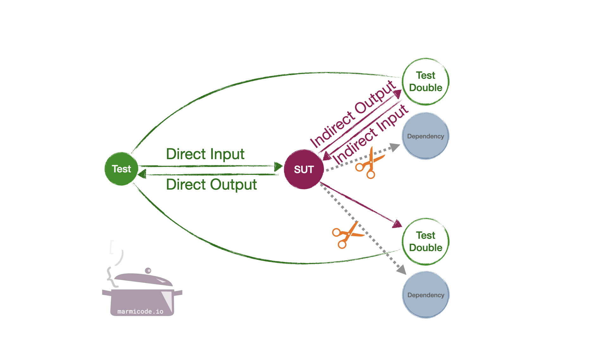

import { ImageContainer } from '@site/src/components/image-container';
import { MegaQuote } from '@site/src/components/mega-quote';
import { Stackblitz } from '@site/src/components/stackblitz';
import { Youtube } from '@site/src/components/youtube';

## There Are Mocks Among Us

> _"There Are Mocks Among Us," the tests whisper in the stillness. Listen closely — the truth may be hiding in plain sight._

<Youtube title="From Mock Spaghetti to Gourmet Fakes" videoId="dXyiOUzdmKk" />

In most cases, you can't rely on end-to-end tests alone.

Eventually, you'll need to stop code execution from flowing through the entire app — including code you own, code you don't, the network, the database, the file system, the LLMs, and so on. **You'll want to narrow down your tests** to speed things up, tighten the feedback loop, gain precision, reduce flakiness, and improve overall stability.

But **isolating code isn't as easy as just cutting connections**. You can't sever a service and call it a day. Instead, you swap out dependencies with [test doubles](../06-glossary.md#test-doubles) _(e.g., mocks, stubs, spies, fakes, etc.)_.

<ImageContainer size="medium">
  
</ImageContainer>

And here's where the naming gets a bit messy.

:::info Mocks are not real
It is common to refer to all test doubles as "mocks," but technically, mocks are just one kind — and believe it or not, **real mocks are surprisingly rare in practice**.
:::

## The Mock

A mock is a test double that's pre-programmed with interaction expectations — before the [System Under Test (SUT)](../06-glossary.md#system-under-test-sut) is even exercised, namely during the "arrange" phase of the test.

> _Tests written using *Mock Objects* look different from more traditional tests because all the expected behavior must be specified **before** [emphasis in original] the SUT is exercised._
>
> — _Gerard Meszaros, xUnit Test Patterns_

Imagine an Angular component that fetches data — say, cookbooks — using a service called `CookbookRepository`.

**In Vitest, a mock of the `CookbookRepository` service might look like this**:

```ts
// Arrange
const repo: Mocked<CookbookRepository> = {
  searchCookbooks: vi.fn(),
};

repo.searchCookbooks
  // first call has no keywords and returns all cookbooks
  .mockImplementationOnce(({ keywords }) => {
    expect(keywords).toBe(undefined);
    return of([ottolenghiSimple, ...otherCookbooks]);
  })
  // second call filters cookbooks related to "Ottolenghi"
  .mockImplementationOnce(({ keywords }) => {
    expect(keywords).toBe('Ottolenghi');
    return of([ottolenghiSimple]);
  })
  // we are not expecting any additional calls
  .mockImplementation(() => {
    throw new Error('Superfluous call');
  });

// Act
...

// Assert
...
expect(repo.searchCookbooks).toHaveBeenCalledTimes(2);
```

Not something you see every day, right?

:::tip
You have to program the methods through the `repo` object to ensure they are type-safe — without having to type each method individually.
:::

:::warning
One major drawback of mocks is that a failed assertion will throw an error, which is caught by the test framework _(e.g., Vitest)_. However, if the SUT catches the error, the test will pass and result in a [false negative](../06-glossary.md#false-negative).
:::

## The Spying Stub

Usually — in the JavaScript world at least — when people refer to mocks, they're talking about what I call "**Spying Stubs**".

- They are **stubs** because they are programmed with return values — **the indirect inputs of the SUT**.
- They are **spying** because they track calls received for later verification — **the indirect outputs of the SUT**.

Here's what one looks like:

```ts
// Arrange
const repo: Mocked<CookbookRepository> = {
  searchCookbooks: vi.fn()
};

repo.searchCookbooks
  .mockReturnValueOnce(of([ottolenghiSimple, ...otherCookbooks]))
  .mockReturnValueOnce(of([ottolenghiSimple]));

// Act
...

// Assert
...
expect(repo.searchCookbooks).toHaveBeenCalledTimes(2);
expect(repo.searchCookbooks).toHaveBeenNthCalledWith(1);
expect(repo.searchCookbooks).toHaveBeenNthCalledWith(2, {
  keywords: 'Ottolenghi'
});
```

:::note
Note how the lack of cohesion between of the expected arguments and return values harms readability and maintainability.
:::

### Cognitive Load and High Maintenance

At first glance, using spying stubs seems straightforward — but you quickly realize that each test requires you to pause and consider:

- What is the API of the dependency?
- Which methods will be called by the SUT and need to be stubbed and/or spied on? What should they return?
- What arguments should they receive? Is it type-safe?
- Will there be multiple calls? In which order?

**Mocks and Spying Stubs often over-specify tests by requiring precise interaction definitions.** This makes tests structure-sensitive, increases maintenance overhead, and reduces flexibility as dependencies evolve.

For example, consider an admin dashboard for managing cookbooks. It uses a `CookbookRepository` which has methods such as:

- `updateCookbook`: updates a single cookbook.
- `batchUpdateCookbooks`: updates multiple cookbooks at once.

Initially, your component uses `updateCookbook`, so you stub and spy on it. Later, when the implementation switches to `batchUpdateCookbooks`, **you must update all your tests accordingly**.

Instead of focusing on the SUT's behavior, you're now entangled with the API of its dependencies.

Moving on, what if you didn't participate in the development of that service? Understanding its logic becomes guesswork. **You might create a Spying Stub that doesn't reflect real behavior** — leading to false positives _(wasting your time)_ or false negatives _(letting bugs slip through)_.

Worse, if a widely-used service changes its API, you're suddenly on the hook for updating return values and argument expectations across every affected test.

<MegaQuote>
  Spying Stubs _(or spies and stubs in general)_ introduce **unnecessary
  cognitive load**. Instead of focusing on the SUT, your tests become entangled
  with the APIs of its dependencies.
</MegaQuote>

### Inconsistency

<MegaQuote>
  Spying Stubs are prone to getting out of sync with reality.
</MegaQuote>

Say you stub `CookbookRepository#searchCookbooks` to always return the same list. That probably means it's ignoring any filtering arguments passed to it.
It will likely not reflect any calls to `CookbookRepository#addCookbook` or `CookbookRepository#removeCookbook`.

This inconsistency can lead to false positives, false negatives, and **confusing debugging sessions that will make you hate testing**.

Here are some additional real-world examples where Spying Stubs can lead to inconsistencies:

- An authentication service with methods like `Auth#isSignedIn`, `Auth#getUserInfo`, and `Auth#signIn`.
- A cart service with methods such as `Cart#hasItems`, `Cart#getItems`, and so on.
- A repository with methods to fetch results and facets _(e.g., the number of results for each potential filter)_, such as `CookbookRepository#searchCookbooks` and `CookbookRepository#searchFacets`.
- A geolocation adapter with methods like `Geolocation#isAllowed` (which uses the permissions API under the hood) and `Geolocation#getCurrentPosition`.

### Rarely Type-Safe

<MegaQuote>In practice, Spying Stubs are rarely type-safe.</MegaQuote>

For example, if a method is called without being properly stubbed, it might return `undefined` by default, leading to unexpected behavior:

```ts
cookbookRepository.search().pipe(...);
//                         ^ TypeError: Cannot read properties of undefined (reading 'pipe')
```

Even worse, if the real API changes but your stub doesn't, the tests will keep passing. **You get a comforting green checkmark... and a sneaky bug in production.**

## The Fake

In contrast to mocks and Spying Stubs, which are programmed with specific interactions, fakes are test doubles that mimic real behavior. They are simplified versions of the real dependency.

### No Special Skills or Tools Required

<MegaQuote>Fakes will only require your TypeScript skills.</MegaQuote>

You don't need to learn any new APIs or specific testing libraries or frameworks.

```ts
class CookbookRepositoryFake implements CookbookRepository {
  private _cookbooks: Cookbook[] = [];

  configure({ cookbooks }: { cookbooks: Cookbook[] }) {
    this._cookbooks = cookbooks;
  }

  searchCookbooks(keywords: string): Observable<Cookbook[]> {
    return defer(async () =>
      this._cookbooks.filter((cookbook) => cookbook.title.includes(keywords)),
    );
  }
}
```

### Consistency

Unlike mocks and Spying Stubs, the various methods and properties of a fake are generally consistent with each other.

For example, if you have a `CookbookRepositoryFake` that implements `searchCookbooks`, it will likely return different results depending on previous calls to `CookbookRepositoryFake#addCookbook` and `CookbookRepositoryFake#removeCookbook`.

Similarly, calling `CookbookRepositoryFake#searchFacets` will return facets that align with the results of `CookbookRepositoryFake#searchCookbooks`, since both rely on the same internal state of the fake.

### Reusability

<MegaQuote>
  Since fakes mimic real behavior, they can be reused across different tests.
</MegaQuote>

They often provide specific methods to configure them _(e.g., the `configure` method in the example above)_, so you don't have to implement your own test double for each test.

Additionally, fakes can be reused across different testing frameworks. They can even be reused for demos or other development purposes.

Yes, you can reuse them in Storybook!

### Low Cognitive Load

<MegaQuote>
  Fakes let you focus on what your component does, not how its dependencies
  work.
</MegaQuote>

The fake is the only type of test double that shifts the burden of implementation and maintenance away from each test. Rather than having to create their own Spying Stubs or mocks, tests can rely on a shared fake maintained alongside the dependency by its owners — whether that's another team, a library author, or even you at a different time.

This increases the likelihood that the fake behaves like the real service, thereby reducing the risk of both false positives and false negatives.

### Resilience to Structural Changes

Remember the `CookbookRepositoryFake#updateCookbook` vs `CookbookRepositoryFake#batchUpdateCookbooks` [drama above](#cognitive-load-and-high-maintenance)?

<MegaQuote>
  With fakes, you don't need to worry about interactions or which method was
  called. You only care about the outcome.
</MegaQuote>

Instead of pre-programming `CookbookRepositoryFake#updateCookbook` or `CookbookRepositoryFake#batchUpdateCookbooks` and verifying their calls, you simply check whether the cookbooks were updated in the fake:

```ts
// Arrange: set up the fake
cookbookRepositoryFake.configure({
  cookbooks: [ottolenghiSimple, ...otherCookbooks],
});

// Act: Interact with the UI you are testing to update a cookbook
...

// Assert: Verify that the cookbook was updated
expect(cookbookRepositoryFake.getCookbooksSync()).toContainEqual(
  expect.objectContaining({
    id: 'cbk_ottolenghi-simple',
    title: 'Ottolenghi (kind of) simple.',
  }),
);
```

The test focuses on behavior rather than internal mechanics _(e.g. `CookbookRepositoryFake#updateCookbook` or `CookbookRepositoryFake#batchUpdateCookbooks`)_, making it less brittle and easier to maintain.

### Debuggability

Need to know what's happening?

With a fake — unlike mocks or Spying Stubs — you can just log something or set a breakpoint. No special tools or tricks required.

It's just you and your code.

## Cooking a Fake

Let's assume you're working on a cookbook app. You want to test the search UI, which allows users to search for cookbooks by keywords and other filters. The app relies on a `CookbookRepository` service to fetch the cookbooks.

We can break down the process of creating a fake into five steps.

### 1. _[Optional]_ Define or Derive the Interface

First, define the interface shared between the fake and the real service:

```ts
interface CookbookRepository {
  searchCookbooks(keywords: string): Observable<Cookbook[]>;
}
```

:::info Hexagonal Port
This interface is the port in a hexagonal architecture.
:::

Alternatively, you can derive the interface from the service implementation:

```ts
/* Extracts the public properties and methods. */
type Public<T> = Pick<T, keyof T>;

class CookbookRepositoryFake implements Public<CookbookRepositoryImpl> {}
```

:::warning
While deriving the interface is convenient for simple cases, it has some drawbacks:

- It discourages designing the service's API upfront.
- It doesn't ensure the fake depends only on core types, avoiding infrastructure-specific types _(e.g., third-party libraries or remote services)_.
- It creates a direct dependency between the fake and the real service, which can lead to issues in environments where certain dependencies cause problems _(e.g., third-party libraries)_.
  :::

<details>
<summary>**⚖️ Abstraction & Tree-Shakability**: Organizing interfaces, implementations, and providers</summary>

You can use the interface as an injection token by turning it into an abstract class:

```ts
abstract class CookbookRepository {
  abstract searchCookbooks(keywords: string): Observable<Cookbook[]>;
}
```

This allows you to inject it as follows:

```ts
const repo = inject(CookbookRepository);
```

However, this approach requires configuring providers:

```ts
providers: [
  {
    provide: CookbookRepository,
    useClass: CookbookRepositoryImpl,
  },
],
```

In most cases, you will prefer providing the default implementation automatically in the root injector using `providedIn: 'root'` for tree-shakability.

While the following code works:

```ts
@Injectable({
  providedIn: 'root',
  useFactory: () => inject(CookbookRepositoryImpl),
})
abstract class CookbookRepository {
  abstract searchCookbooks(keywords: string): Observable<Cookbook[]>;
}
```

it introduces some caveats:

- It creates a circular dependency between `CookbookRepository` and `CookbookRepositoryImpl`.
- It makes `CookbookRepositoryImpl` a transitive dependency of `CookbookRepositoryFake`.

To avoid these issues, **separate the interface from the abstract class used as the injection token**:

```ts
interface CookbookRepositoryDef {
  searchCookbooks(keywords: string): Observable<Cookbook[]>;
}

@Injectable({
  providedIn: 'root',
  useFactory: () => inject(CookbookRepositoryImpl),
})
abstract class CookbookRepository implements CookbookRepositoryDef {}

@Injectable({ providedIn: 'root' })
class CookbookRepositoryImpl implements CookbookRepositoryDef {
  ...
}

@Injectable()
class CookbookRepositoryFake implements CookbookRepositoryDef {
  ...
}
```

For simpler cases where there is only one implementation and no need for the `CookbookRepository => CookbookRepositoryImpl` indirection:

```ts
interface CookbookRepositoryDef {
  searchCookbooks(keywords: string): Observable<Cookbook[]>;
}

@Injectable({ providedIn: 'root' })
class CookbookRepository implements CookbookRepositoryDef {
  ...
}

class CookbookRepositoryFake implements CookbookRepositoryDef {
  ...
}
```

</details>

### 2. Implement the Fake

```ts
@Injectable()
class CookbookRepositoryFake implements CookbookRepository {
  private _cookbooks: Cookbook[] = [];

  searchCookbooks({ keywords }: { keywords: string }): Observable<Cookbook[]> {
    return defer(async () => {
      return this._cookbooks.filter((cookbook) =>
        cookbook.title.includes(keywords),
      );
    });
  }

  ...
}
```

:::tip
You don't need to implement the entire service — only the methods you actually use. Any others should throw an error if called.
:::

```ts
@Injectable()
class CookbookRepositoryFake implements CookbookRepository {
  private _cookbooks: Cookbook[] = [];

  searchCookbooks({
    keywords,
    difficulty,
  }: {
    keywords: string;
    difficulty?: Difficulty;
  }): Observable<Cookbook[]> {
    return defer(async () => {
      // highlight-start
      if (difficulty != null) {
        throw new Error(
          '🚧 CookbookRepositoryFake#searchCookbooks does not support difficulty filtering yet',
        );
      }
      // highlight-end

      return this._cookbooks.filter((cookbook) =>
        cookbook.title.includes(keywords),
      );
    });
  }

  // highlight-start
  updateCookbook(cookbookId: string, data: Partial<Cookbook>) {
    throw new Error(
      '🚧 CookbookRepositoryFake#updateCookbook is not implemented yet',
    );
  }
  // highlight-end

  ...
}
```

:::info
In contrast to stubs, if the fake is used in an unexpected way _(e.g., calling a not implemented method, passing invalid or unhandled arguments)_, **it will throw an error instead of silently returning `undefined`**.

:::

### 3. Extend the Fake with Testing Utilities

It might be tempting to hardcode some data in the fake, but this approach is inflexible and can result in brittle tests.

Instead, you should provide methods to configure the fake with the data required for your tests, such as `CookbookRepositoryFake#configure`.

If the service mutates its state, consider adding methods to inspect the state of the fake. For example, if the service includes a method like `updateCookbook`, you might want to implement a method such as `CookbookRepositoryFake#getCookbookSync` to verify the current state of the fake.

Only implement these methods when necessary. The goal is to keep the fake as simple and maintainable as possible.

```ts
@Injectable()
class CookbookRepositoryFake implements CookbookRepository {
  private _cookbooks: Cookbook[] = [];

  // highlight-start
  configure({cookbooks}: {cookbooks: Cookbook[]}) {
    this._cookbooks = cookbooks;
  }

  getCookbooksSync(): Cookbook[] {
    return this._cookbooks;
  }
  // highlight-end

  ...
}
```

### 4. Create a Provider Factory

To enhance the developer experience, you can create a provider factory that supplies the fake and replaces the real service.

```ts
import { EnvironmentProviders, makeEnvironmentProviders } from '@angular/core';

export function provideCookbookRepositoryFake(): EnvironmentProviders {
  return makeEnvironmentProviders([
    CookbookRepositoryFake,
    {
      provide: CookbookRepository,
      useExisting: CookbookRepositoryFake,
    },
  ]);
}
```

:::tip
With `useExisting`, the same instance of the fake is provided as both `CookbookRepositoryFake` and `CookbookRepository`.

This approach allows you to inject the fake in your tests and use its specific methods without needing to downcast it.

```ts
// ✅
const fake = TestBed.inject(CookbookRepositoryFake);

// ❌
const fake = TestBed.inject(CookbookRepository) as CookbookRepositoryFake;
```

:::

:::tip
Note that the fake is not "provided in root" on purpose so that you do not forget to override the real service in your tests by using the provider factory.
:::

### 5. Use the fake in tests

You can now use the fake in your tests as follows:

```ts
TestBed.configureTestingModule({
  providers: [provideCookbookRepositoryFake()],
});
```

Additionally, fakes can be useful in your app for demos.

## Key Takeaways & Tips

- 🐒 Favor fakes over other types of test doubles.
- 🤷🏻‍♂️ Only implement the test double APIs that are necessary for your tests.
- 🤔 Choose dependencies to replace carefully. See [The Widest Narrow Test](../02-designing-a-pragmatic-testing-strategy/index.mdx#the-honeycomb-testing-model) for guidance.
- 😱 If you find yourself managing too many test doubles, you might be replacing the wrong dependencies.
- 😌 Minimize the number of test doubles in a single test. A high number often indicates fragile design or overly narrow or overly wide tests.
- 💪 Ensure your test doubles are type-safe and throw errors when encountering unhandled parameters.
- 🔌 Avoid creating fakes for services you don't own. Instead, build your own adapters.

## Source Code

<Stackblitz
  title="Angular Testing using a Fake"
  repo="marmicode/cookbook-demos"
  branch="angular-testing"
  file="apps/demo/src/app/fake-it-till-you-mock-it/cookbook-search.spec.ts"
  initialPath="/__vitest__/"
/>

## Additional Resources

- 📝 [**Mocks Aren't Stubs** by Martin Fowler (2007)](https://martinfowler.com/articles/mocksArentStubs.html)
- 📺 [**Fake it Till you Mock it @Ng-De** by Younes Jaaidi (2024)](https://youtu.be/YLHXguodICg)
- 📚 [**xUnit Test Patterns - Refactoring Test Code** by Gerard Meszaros (2007)](https://google.com/books/edition/xUnit_Test_Patterns/-izOiCEIABQC?kptab=getbook)

## Deep Dive into Test Doubles

Want to go deeper into test doubles? [**Check out my Pragmatic Angular Testing Video Course!**](https://courses.marmicode.io/courses/pragmatic-angular-testing?utm_source=cookbook&utm_medium=in-article&utm_campaign=fake-it-till-you-mock-it&utm_content=fake-it-till-you-mock-it) You'll explore their **types**, **use cases**, and **practical examples** — plus **hands-on exercises** to level up your Angular testing skills.

<ImageContainer size="large">
  [](https://courses.marmicode.io/courses/pragmatic-angular-testing?utm_source=cookbook&utm_medium=in-article&utm_campaign=fake-it-till-you-mock-it&utm_content=fake-it-till-you-mock-it)
</ImageContainer>

<center>
  [**👉 Enroll Now
  👈**](https://courses.marmicode.io/courses/pragmatic-angular-testing?utm_source=cookbook&utm_medium=in-article&utm_campaign=fake-it-till-you-mock-it&utm_content=fake-it-till-you-mock-it)
</center>
