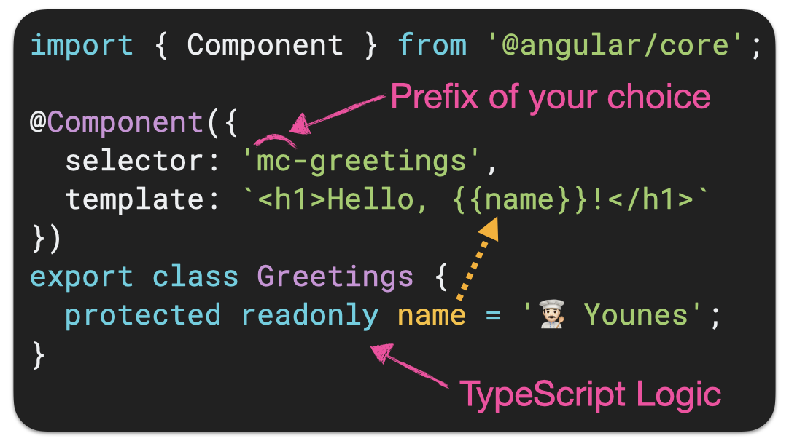

In Angular, a component is a class decorated with the [`@Component`](https://angular.dev/api/core/Component) decorator.

Let's explore each part of a component in detail:

## Selector

The selector defines the custom HTML tag that represents your component in templates.
This is the tag you'll use to include this component in a parent component's template — i.e. `<mc-hello/>`.

### Prefix

You can choose any prefix for your selector, but you may need to configure your linter to accept your prefix — instead of the default value which is `app`.

:::tip Choose your prefix when creating your app
When generating a new app, you can use the `--prefix` option to set your prefix, and let Angular configure the linter for you.
:::

## Template

The template defines the view for your component.

:::info
It is an Angular template, not plain HTML. So you might see things there that are not allowed in plain HTML.
:::

:::tip Prefer inline templates
While it's also possible to write your template in a separate HTML file using the `templateUrl` property, I highly recommend writing it inline — as shown in the example above.

In my experience, teams that favor inline templates naturally build more focused, cohesive components — resulting in cleaner structure and a more maintainable codebase.
With less file clutter, the project structure is also more readable.
:::

## Styles

The styles defined in the `styles` property are scoped to the component. By default, they do not leak outside the component — not even the children.

:::tip Prefer inline styles
Just like templates, I highly recommend to write styles inline — as shown in the example above.

An exception is components with heavy styling — like a fancy banner. In that case, it often makes sense to move the styles to a separate file.
:::

## TypeScript Logic

The TypeScript class contains the logic that controls the behavior of your component.

### Why use `protected` for properties?

When you mark a component's property as `protected`, it's only accessible from the component's TypeScript logic and its template — but not from outside the component. This prevents anything else from accessing it directly.
