import { ImageContainer } from '@site/src/components/image-container';
import { MegaQuote } from '@site/src/components/mega-quote';

# Designing a Pragmatic Testing Strategy

The main goals to keep in mind when designing a testing strategy are:

- **💪 Confidence**: The tests should provide a high level of confidence to the team that the product works as expected.
- **🪙 Cost**: The tests should be cheap to write and, more importantly, cheap to maintain. Writing tests should not slow down the development process.
- **⚡️ Feedback Speed**: The tests should run fast. If the tests take too long to run, the team will run them less often and will be slowed down in the development process by the feedback loop.

## Tests Are Safety Nets

We want to prevent bugs from reaching users, just like a trapeze artist wants to avoid falling to the ground.

Tests _([Narrow](../../02-glossary.md#narrow-tests) and [Wide](../../02-glossary.md#wide-tests))_ are safety nets among others like [Dogfooding](../../02-glossary.md#dogfooding) or [Canary Release](../../02-glossary.md#canary-release).

<ImageContainer size="small">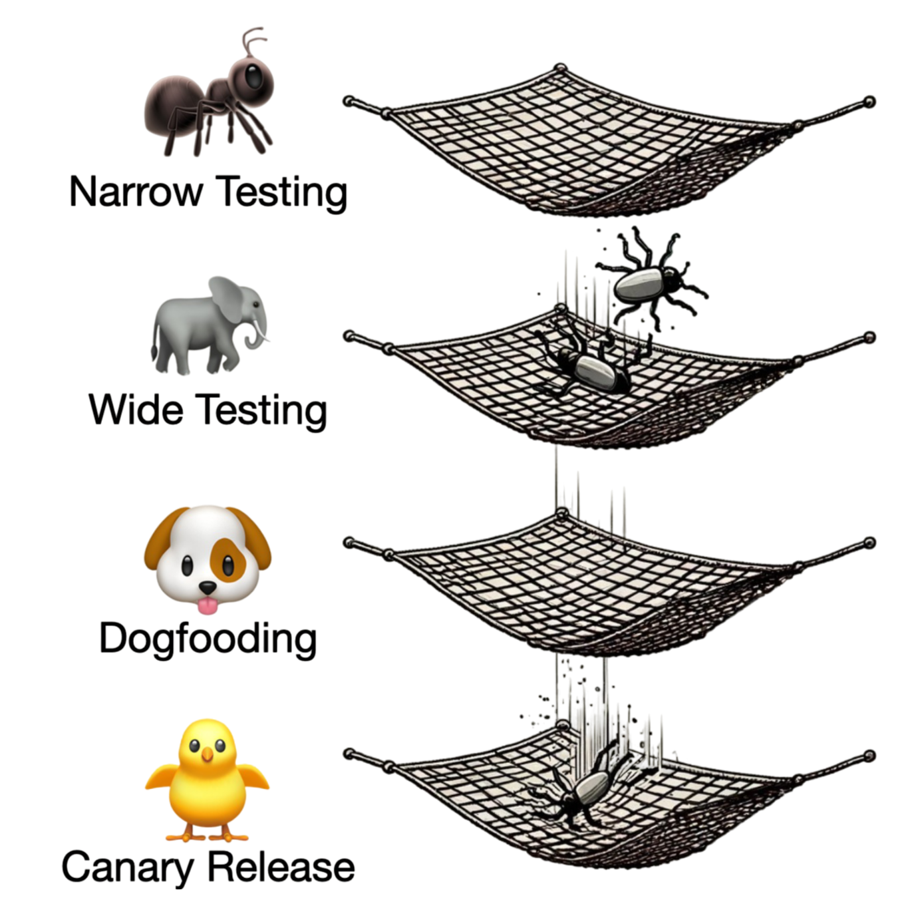</ImageContainer>

<MegaQuote>
  It is **cheaper and faster to recover from the first safety net** than the
  last one.
</MegaQuote>

### The Falling Trapeze Artist

When a trapeze artist falls, it takes minutes to recover from the first safety net, then the show goes on. But if they fall through the first safety net and hit the landing mat at the bottom of the circus tent _(last "safety net")_, it can take weeks or months to recover. The cost of recovery is also higher _(e.g., audience shock, financial shortfall, medical expenses, etc.)_.

Needless to say, developing without tests is like performing trapeze without a safety net. It is spectacular, yet reckless.

## Test Categories Distribution Models

### Beware the Ice Cream Cone Model

A common oversight when designing a testing strategy is to mainly focus on [Wide tests](../../02-glossary.md#wide-tests) in general. Things get even worse when the model is topped with a few calories of manual testing.

<ImageContainer size="medium">
  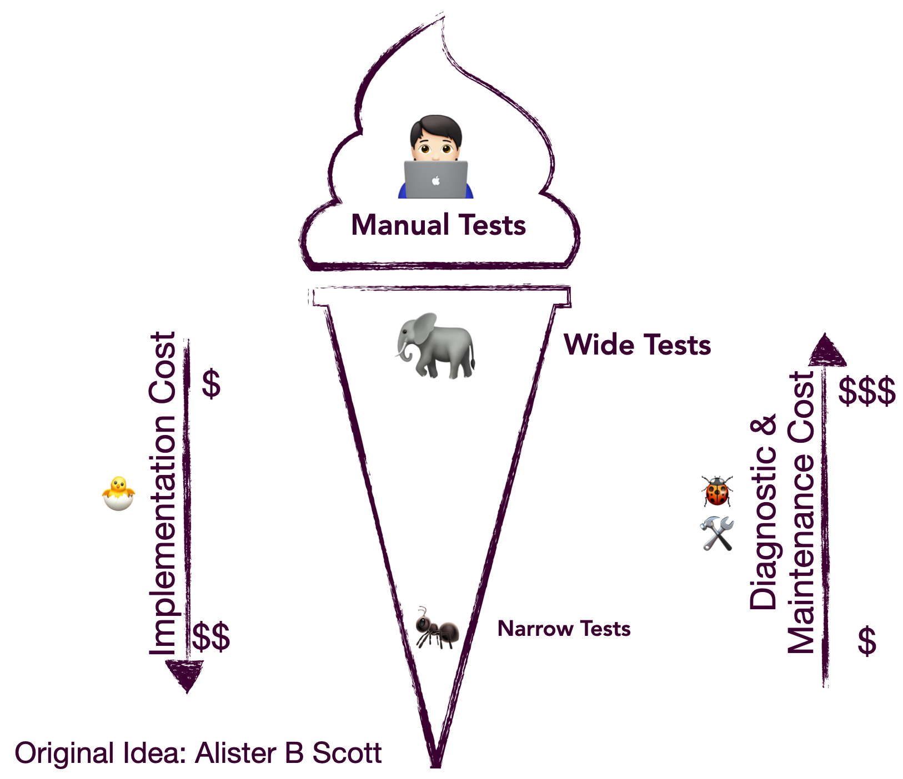
</ImageContainer>

While such a model could work for a simple product with small ambitions, it **does not scale**.

The main issues with the Ice Cream Cone Model are:

- Obviously, manual testing is slow, expensive, and error-prone. _(Humans are bad at repetitive tasks.)_
- **🐢 Slow Feedback Loop**: Wide tests are slow, and we often have to run them all as it is not always easy to only run [Affected Tests](../../02-glossary.md#affected-tests) for Wide tests.
- **💰 Expensive to Maintain**: Wide tests are attractive as they might sometimes require less setup _(e.g., fewer Test Doubles)_ than Narrow tests. While this can make the initial implementation cheaper, the maintenance cost is generally much more expensive. For instance, Wide tests are not precise by nature and require a higher [cognitive load](../01-beyond-unit-vs-integration/index.mdx#low-cognitive-load). Debugging failing Wide tests is therefore a recurring and expensive task.

### What Went Wrong with the Test Pyramid?

The Test Pyramid has been a commonly accepted model for around 20 years. The idea is to focus more on Narrow tests than on Wide tests.

<ImageContainer size="medium">
  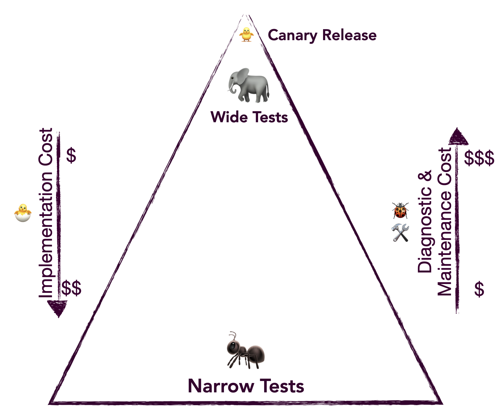
</ImageContainer>

The Test Pyramid is a great model to follow, but **it is often misunderstood for two reasons**:

- From the shape of the pyramid, one might think that the narrower the tests are, the better.
- The test pyramid bottom layer is generally defined as "unit tests", but as mentioned in the [previous chapter](../01-beyond-unit-vs-integration/index.mdx), the "unit test" term is confusing and often misinterpreted.

Due to this frequent misunderstanding, **developers might end up with tests that are too Narrow**. The problem with such tests is that they are:

- **[Over-Specifying](../../02-glossary.md#over-specification)**: They are too structure-sensitive and coupled to implementation details. They do not survive refactoring.
- **Expensive to Implement**: They require substantial test setup and [test double](../../02-glossary.md#test-doubles) orchestration.
- **Expensive to Maintain**: Being over-specifying makes them expensive to maintain.
- **Not [Predictive](../../02-glossary.md#predictive)**: They are so [asymmetric to production](../../02-glossary.md#symmetric-to-production) that they are not predictive of the system's behavior. All the tests pass, but the feature is actually broken.

### The Honeycomb Testing Model

To highlight the fact that Narrow tests should not be too narrow, **prefer the Honeycomb Testing Model**.

<ImageContainer size="medium">
  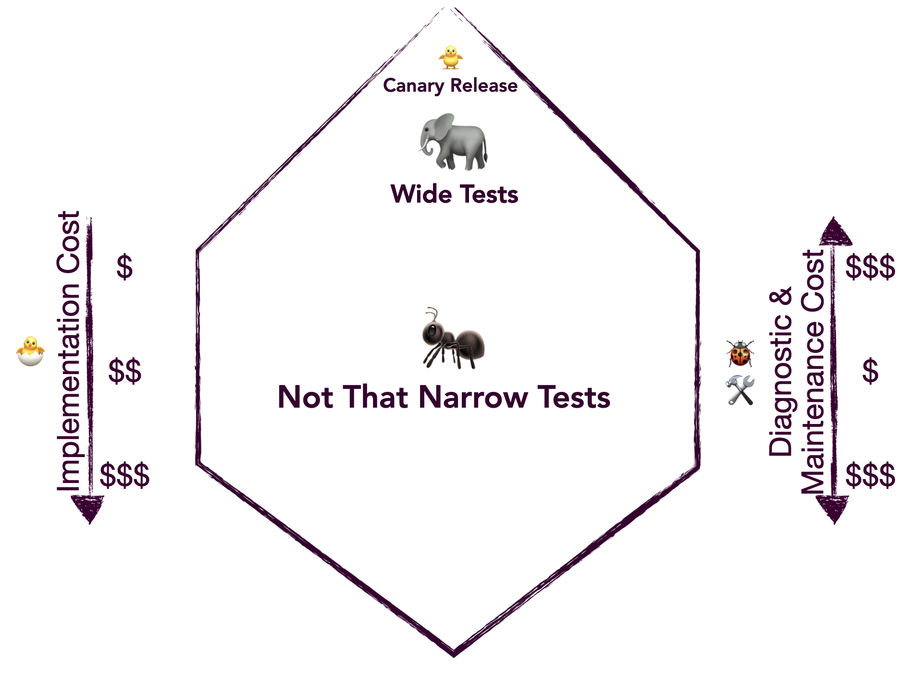
</ImageContainer>

<MegaQuote>
  The goal here is to focus on the widest tests that honor the [Narrow test
  definition](../01-beyond-unit-vs-integration/index.mdx#narrow-tests): fast,
  isolated & parallelizable, and **low cognitive load**.
</MegaQuote>

### Progressive Confidence

It can be hard to decide how narrow or wide a test should be. Here is another tool that can help you decide: **Progressive Confidence**.

<ImageContainer size="medium">
  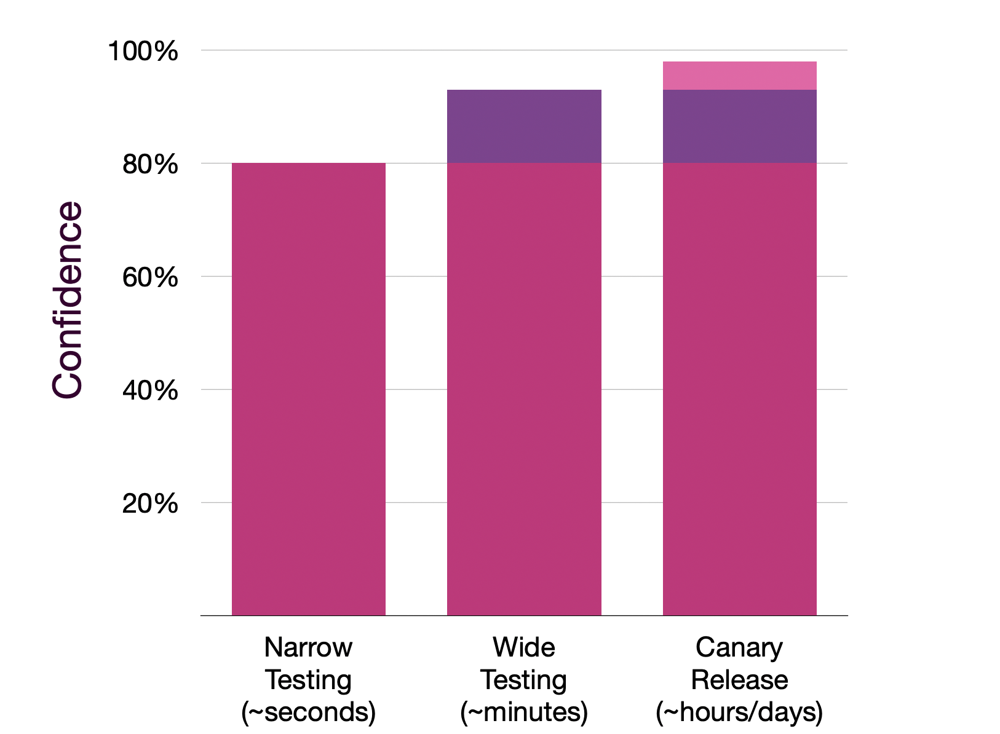
</ImageContainer>

<MegaQuote>
  For most changes, the team should have a relatively high level of confidence
  after few seconds to minutes of running the affected Narrow tests.
</MegaQuote>

Wider tests and other safety nets like Canary Release are only there to push confidence the extra mile and get as close as possible to ~99% before general availability.

## When to Narrow Down a Test

Sometimes, what started as a Narrow test becomes a Wide test. **Think of narrowing down your tests when necessary**. Here are some indicators that it may be time to narrow down your test:

- the **System Under Test is becoming too complex**,
- the test requires **too many test doubles**,
- or certain parts of the System Under Test are **widely shared across the product**. _(For example, open-source libraries and organization-wide shared libraries require narrower tests.)_

## Strengthening the Safety Nets

Bugs can slip through some of the safety nets. Even if another safety net eventually catches the bug, **it is crucial to improve the earlier safety nets**. This is especially important if bugs went through the same hole in the net more than once.

For example, if some of your end-to-end tests often catch the same bugs, consider adding some Narrow tests to that specific area.

## Example: Adapting to the Situation

For a simple product with small ambitions, one might start with some Wide tests.

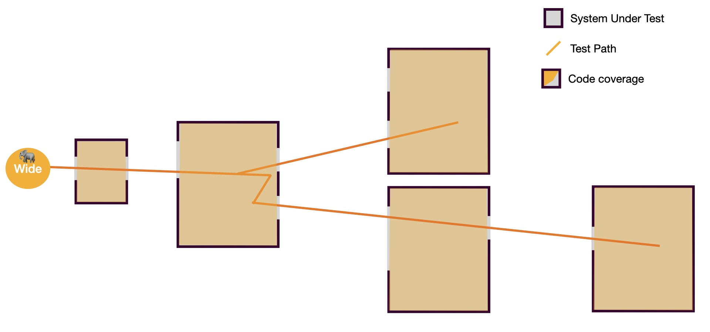

This could be fair enough until:

- some edge cases become hard to cover with Wide tests,
- the tests start relying on external services, making them slow and flaky,
- the tests become hard to isolate and parallelize.

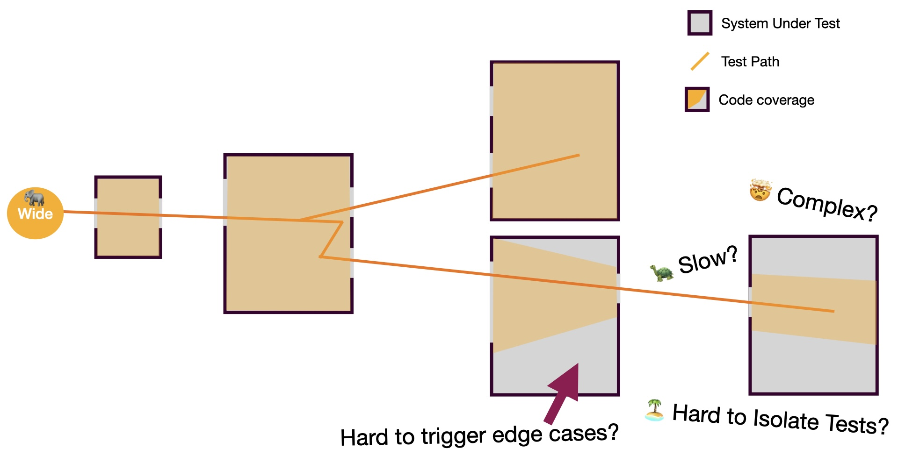

Then, it is time to start zooming in with some Narrow tests.

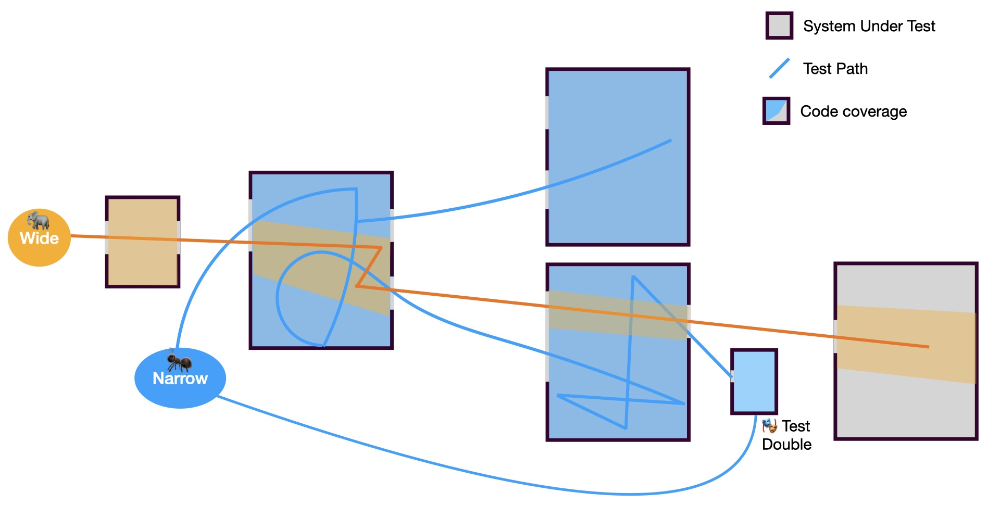

Sometimes, it will not be enough as some parts of the System Under Test become too complex or too widely shared.

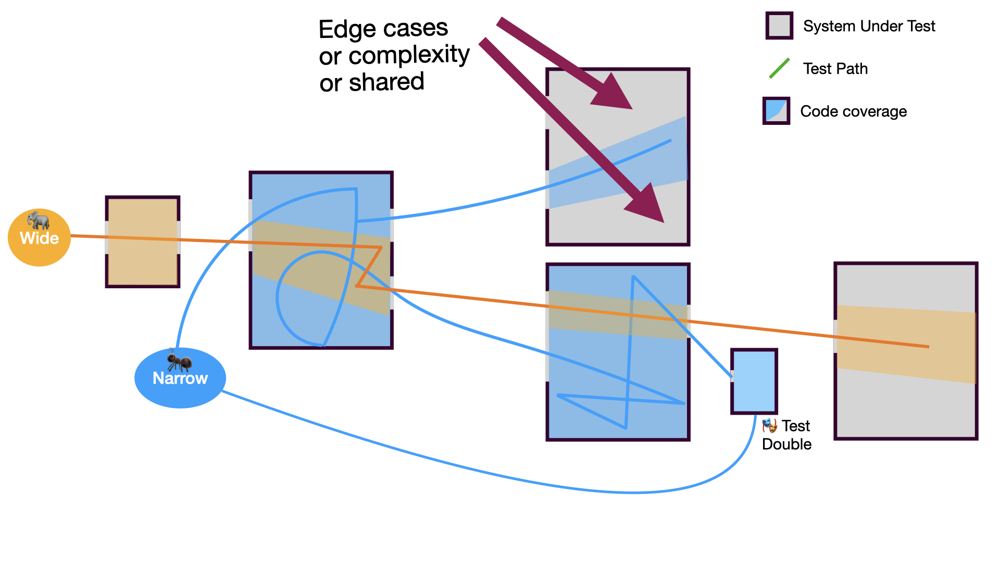

That is when you should consider zooming in even more with narrower tests.

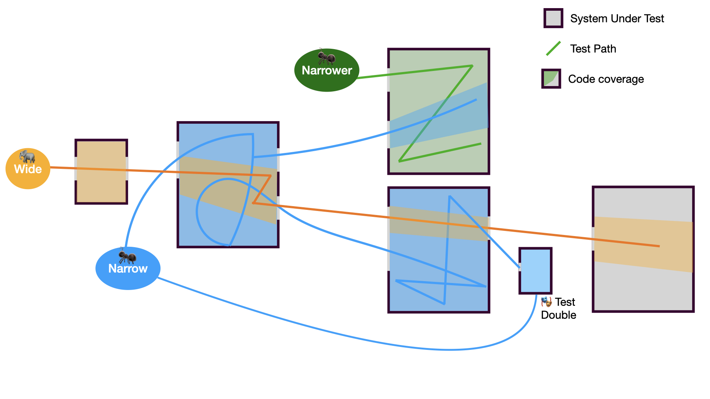

## Composability

Interestingly, in the example above, we can observe that with such an approach, we can reach a relatively high level of confidence with only a few tests (<span style={{color: 'orange'}}>**1 Wide**</span>, <span style={{color: '#1298fb'}}>**2 Narrow**</span>, <span style={{color: 'green'}}>**1 narrower**</span>) and one Test Double. Our tests are [**composable**](../../02-glossary.md#composable).

The **two extremes that wouldn't work** are the following:

- **Only Wide Tests** _(ice-cream cone)_: We would probably require dozens of relatively complex Wide tests to reach all the edge cases and the same level of confidence.
- **Over-Narrow Tests** _(misunderstood pyramid)_: We would probably require dozens of over-narrow tests and 3 to 4 Test Doubles to reach all the edge cases.

## What Should Be Tested?

<MegaQuote>Ask future-you! 🫵</MegaQuote>

Put yourself in the shoes of a new maintainer joining your team in 5 weeks... or 5 years. What would you hope was tested to make your contribution smoother and more confident?

### Risk Assessment

Another approach is to **compare the cost of testing something to the cost of fixing a related bug when caught by users** _(after piercing through the holes of all the safety nets)_.
Here are some examples:

- Is it cheaper to test that [AG Grid](https://www.ag-grid.com/angular-data-grid/column-sizing/)'s `resizable` or [Tanstack's Table](https://tanstack.com/table/v8/docs/framework/angular/angular-table#createangulartable)'s `enableColumnResizing` option was properly forwarded to the underlying library, or to fix a bug related to it after a user reports that they cannot resize columns?
- Is it cheaper to test the integration with a Payment API or break the checkout process for a few users... or all users... then spend a few hours debugging and fixing?
- Is it cheaper to test that some rare error case is displaying an actionable error message or to have a customer support agent spend 30 minutes on the phone with each impacted user?

While you might think that the answer to all these examples is obvious, it is actually subjective. The answer depends on the context of your product, the phase of the product _(Cf. [3X](../../02-glossary.md#3x))_, the team, and the users _(their nature and volume)_, among other things.

### The Testing Strategy Should Be Part of the Design Doc

When designing a new feature, the testing strategy for that specific feature should be part of the [Design Doc](../../02-glossary.md#design-doc) _(or whatever drawings or notes you make before coding)_. The testing strategy should be as important as the architecture.

What if there is no Design Doc? Well, maybe you should give it a try.

### Development Time Perception Bias

You might have heard this before:

> _"We'd love to write tests, but we don't have time now."_

:::note
If you don't have time now, it is less likely that you will have more time later -- especially since retrofitting tests is generally more expensive.
:::

:::warning
Obviously, with the wrong testing strategy _(Cf. [Ice Cream Cone Model](#beware-the-ice-cream-cone-model) or [The Misunderstood Pyramid](#what-went-wrong-with-the-test-pyramid))_, writing tests can slow down the development process.
:::

However, even with a good testing strategy, the feeling of not having enough time to write tests will probably remain for a while. I call this the **Development Time Perception Bias**:

<MegaQuote>
  Development Time Perception Bias is the illusion of faster development without
  tests due to the permanent action and the heat of the moment _(code, manual
  test, debug, fix, ...)_.
</MegaQuote>

- **The Aim**: My initial intention is to be a good kid and follow a TDD approach: I want to write a test, see it fail, make it pass, then tidy up.
- **The Attraction**: Then I am drawn to the implementation details by the code mermaids whispering: _"It's just a small change anyway, and you know how to write it properly from the start, right? This way you will not waste time tidying up later. Concerning the test, it's going to be easier to write it once you have the whole implementation done. Generative AI can handle that for you, remember."_
- **The Reality**:
  - I make a change,
  - I start the app,
  - I wait for it to start,
  - oh! what is this new strange unrelated warning in the console? Let's fix it,
  - 30 minutes later, where was I? Oh yes, the change,
  - I open a browser,
  - oh oops, the session expired, I have to authenticate,
  - oh two-factor authentication, let's find my phone,
  - let's fill this long form again, the component I am working on is the 7th step of the wizard,
  - how come the loader is just spinning and nothing is happening?
  - let's debug,
  - oh, got it, the condition is wrong, let's fix it,
  - ...
- **The Perception**: Yay! I am done! That was fast! Wait a minute, why is it dark outside? Where did the day go? Anyway, I couldn't have done it faster, especially if I had to write tests in addition to the feature. After all, the code is not that complex, it does not need tests.

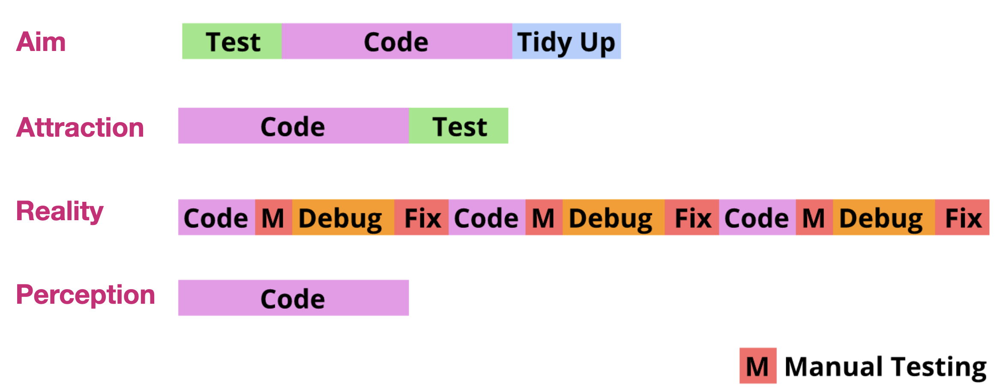

Testing, and more precisely TDD, **keeps us focused on the task at hand, enabling us to develop faster and more efficiently**.

### The Wedding Registry Anecdote

I had the privilege of being "born" into [eXtreme Programming](../../02-glossary.md#extreme-programming) _(XP)_. My first job _(back in 2007)_ was with a team deeply committed to XP values and practices. As the least experienced developer on the team, [Test-Driven Development](../../02-glossary.md#tdd) _(TDD)_ saved me _(among other practices)_.

Thirteen years later, having always relied on testing and TDD, **I had to challenge my well-established assumptions**. What if we didn't need as much testing? Could there be situations where testing wasn't necessary at all? We don't need tests for a one-shot simple script or some [Spikes](../../02-glossary.md#spike), but we need tests for ambitious products, right? But where is the line?

**I had to try driving without a seat belt**. After all, is a seat belt really necessary in my garage? What about in a parking lot?

I just needed to find the right playground for my experiment. 🤔

The opportunity came when I was building a registry for my own wedding. Since I wasn't planning to marry twice, I assumed the code would be thrown away after the wedding anyway. So, **I decided to build the registry without tests and see what would happen**.

Like someone unfamiliar with testing who can't resist manual testing, I found it difficult to resist the urge to write tests. Despite a few frustrating moments where I wished for a faster feedback loop than manual testing could provide, the development went smoothly.

Why did it go well? Probably because I was working alone. **The application only took a few days to implement, so I was able to keep the entire architecture and all the implementation details in my head.**

A year later, some friends asked if I could provide a similar registry for their wedding. I thought, "What a perfect opportunity for my experiment! **Let's turn this registry into a reusable one.**"

That's when the trouble kicked in. Even though the codebase was simple, every change was more expensive than necessary. **I couldn't move as quickly as I wanted.** Without TDD, I had to overthink every modification. What should I test if I update this third-party dependency or that feature? Manually testing everything was exhausting, and the uncertainty of not knowing when I was done was frustrating. You think you're finished, and then you discover you missed something.

In the end, here is what I learned from one of the least ambitious products I ever built or participated in building:

- You might not need tests for least ambitious features,
- but beyond ambition and longevity, **most features will always be faster to develop with tests** _(given a good testing strategy)_.
- **Feature ambition is unstable** and can evolve in unexpected ways.
- **High cognitive capacity breeds overconfidence**: This experience also made me realize that testing helps me consume my cognitive capacity more wisely. In other words, just because you can keep the whole architecture in your head doesn't mean you should rely on it. The details will eventually fade away.

<MegaQuote>
  You never know what the journey will be, so you better put on your seat belt
  before you start the car.
</MegaQuote>

## How to Evaluate your Testing Strategy?

Here are some metrics that can help you evaluate your testing strategy:

- **🐞 Number of Regressions**
- **😰 Team Confidence**
- **♻️ Feedback Loop Speed**
- **🚨 Number of [False Positives](../../02-glossary.md#false-positive)**
- **🥷 Number of [False Negatives](../../02-glossary.md#false-negative)**

### What About Code Coverage?

As mentioned in my blog post about [Angular Template Code Coverage](https://marmicode.io/blog/angular-template-code-coverage-and-future-proof-testing):

> While code coverage is a useful tool, it should be used wisely. Keep it as an indicator, not a rigid goal.
>
> > _Any observed statistical regularity will tend to collapse once pressure is placed upon it for control purposes._
> >
> > _-- Charles Goodhart_
>
> In other words, **when a measure becomes a target, it ceases to be a good measure**.

### Test Rating

The idea of Test Rating is to rate each test based on the following criteria by incrementing a counter for each of them:

- **False Positives**: if the test wrongly reports a bug that does not exist,
- **False Negatives**: if the test missed a bug it was supposed to catch,
- **Hero**: if the test saved the day by catching a bug that wouldn't have been caught before reaching other safety nets.

These ratings are qualitative metrics that can help you learn which kinds of tests are providing value and which ones are not. You can then refine your testing strategy accordingly.

```ts
/**
 * @falsepositives 2
 * @falsenegatives 3
 * @hero 2
 */
it('...', () => ...);
```

:::note
The Test Rating approach is an experimental idea that I am still refining. If you have any feedback or suggestions, feel free to reach out to me.
:::

## Key Takeaways

- **🚀 Prioritize Confidence, Cost, and Feedback Speed** over anything dogmatic.
- **🍦 Avoid the Ice Cream Cone Model**: do not over-rely on manual or Wide tests.
- **🍯 Adopt the Honeycomb Model**: focus on the widest Narrow tests.
- **🔍 Narrow Down Tests When Necessary**: when the System Under Test becomes too complex or widely shared.
- **🛡️ Strengthen Early Safety Nets**: add Narrow tests to areas where recurring bugs are caught by wide tests.
- **🧠 Design Tests with Future-Maintainers in Mind**: think about what will make future contributions smoother and more confident.
- **📊 Measure Testing Effectiveness using Qualitative Metrics**.
