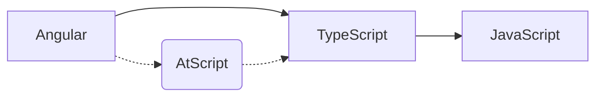
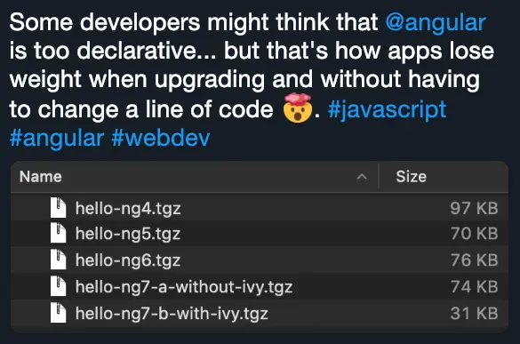

import { ImageContainer } from '@site/src/components/image-container';

# Why Angular?

## Batteries Included

Unlike other libraries and frameworks, Angular comes with everything you need to build modern web applications right out of the box.

- **CLI** - Command-line interface for scaffolding, building, migrating, and deploying
- **Router**
- **HTTP Client**
- **Forms**
- **Testing Utilities**
- **DevTools**
- **Internationalization (i18n)**
- **PWA Support**
- **[Angular Material](https://material.angular.dev/)** - Material Design for Angular.

This "batteries included" approach means less hesitation, faster development, fewer compatibility issues, and a more predictable upgrade path as your application grows.

## Opinionated

Since its beginning, Angular has been opinionated.

The Angular team does its best to provide a consistent way to do things.

There are two major benefits to this:

- **Community Consistency** - Most Angular apps share similar conventions, structure, and tools. This makes it easier to collaborate and onboard new developers.
- **Less Hesitation** - You don't have to spend time researching and evaluating different libraries and tools. This is even more important for developers who are new to the fast-moving web ecosystem.

## Long Run over Hype

Angular's technical choices are made with a long-term perspective in mind.

The Angular team might make hard choices that are not popular in the short term, but they are often the right ones for the long term.

For example, no matter which tools Angular is using internally for the build pipeline, the Angular team will avoid exposing them to the developer. While this can be frustrating for some developers, this is what allowed the community to seamlessly migrate from the old webpack-based build pipeline to the new esbuild-based build pipeline.

## Battle-Tested

Angular is battle-tested with thousands of applications at Google.

:::info
All of the Angular applications at Google are using the same version of Angular which is the last commit on the `main` branch.
:::

## Ecosystem & Community

Angular's ecosystem and community are vast and growing.

The Angular team also collaborates with the community and major third-party libraries such as RxJS or NgRx to ensure a consistent experience.

## TypeScript

Angular was built with TypeScript from the ground up.

:::info
Angular is the framework that made TypeScript popular.
:::

Angular needed annotations to define metadata. The initial plan was to create a language called AtScript on top of TypeScript, but the Angular and TypeScript teams collaborated to bring decorators to TypeScript.

## Versatility

Angular is a versatile framework that can be used to build a wide range of applications.

- **SPA** - Single Page Application
- **PWA** - Progressive Web Application
- **SSR** - Server-Side Rendering
- **SSG** - Static Site Generation
- **Mobile** - with NativeScript, or Ionic.
- **Terminal** - this is a bit of a stretch, but it's possible to build a terminal application with Angular by creating a custom renderer _(Cf. [Rendering Angular applications in Terminal](https://medium.com/angular-in-depth/angular-platforms-in-depth-part-3-rendering-angular-applications-in-terminal-117e4da9c0cc))_.

## Abstraction

Angular provides convenient abstractions to the native APIs that make it easier to build complex applications without having to deal with some low-level implementation details.

## Separation of Concerns

Angular favors separation of concerns through the use of components, directives, and [Dependency Injection](../02-core-concepts/05-dependency-injection/index.md).

:::warning
Separating TypeScript code, templates, and styles in different files is not separation of concerns. The three are highly coupled by design.
:::

## Performance

### Incremental DOM

Angular is one of the first major frameworks to come up with a compiler. In fact, Angular templates are compiled to JavaScript enabling better performance and fine-grained DOM updates.

This approach also allowed Angular to optimize the build from one version to the next without any developer intervention.
Here is an example of a simple application migrated when the Angular team was optimizing the build and releasing the new engine, IVy.

<ImageContainer size="medium">

</ImageContainer>

### Performance by Default

Modern versions of Angular are progressively steering to a **performance by default** approach where developers can get the best performance out of the box without having to do anything special.

## Testability

Angular is testable by design.

It provides native test doubles for most of its building blocks such as the Router or the HTTP client.

## Angular Release Schedule & Long-Term Support

The Angular team is committed to providing a long-term support for the framework:

- Each major version of Angular is [supported for 18 months](https://angular.dev/reference/releases).
- Each version comes with an [update guide](https://angular.dev/update-guide) and more importantly, it also comes with many automated migrations. Without automation, Google wouldn't be able to continuously migrate its thousands of applications to the latest Angular changes from the `main` branch.

### Experimental => Developer Preview => Stable

Some features can go through a three-stage release process:

- **Experimental** - The first stage of a new feature. The feature might receive breaking changes even in patch versions. The feature could also simply be removed at anytime.
- **Developer Preview** - The second stage of a new feature. While the feautre is fully functional and polished, it might receive breaking changes even in patch versions. That said, at this stage, the feature will eventually be promoted to stable.
- **Stable** - The third stage of a new feature. It is ready for production use and is stable.

## Additional Resources

- 📝 [**Angular Material** by Angular](https://material.angular.dev/)
- 📝 [**Angular Versioning and Releases** by Angular](https://angular.dev/reference/releases)
- 📝 [**Angular Update Guide** by Angular](https://angular.dev/update-guide)
