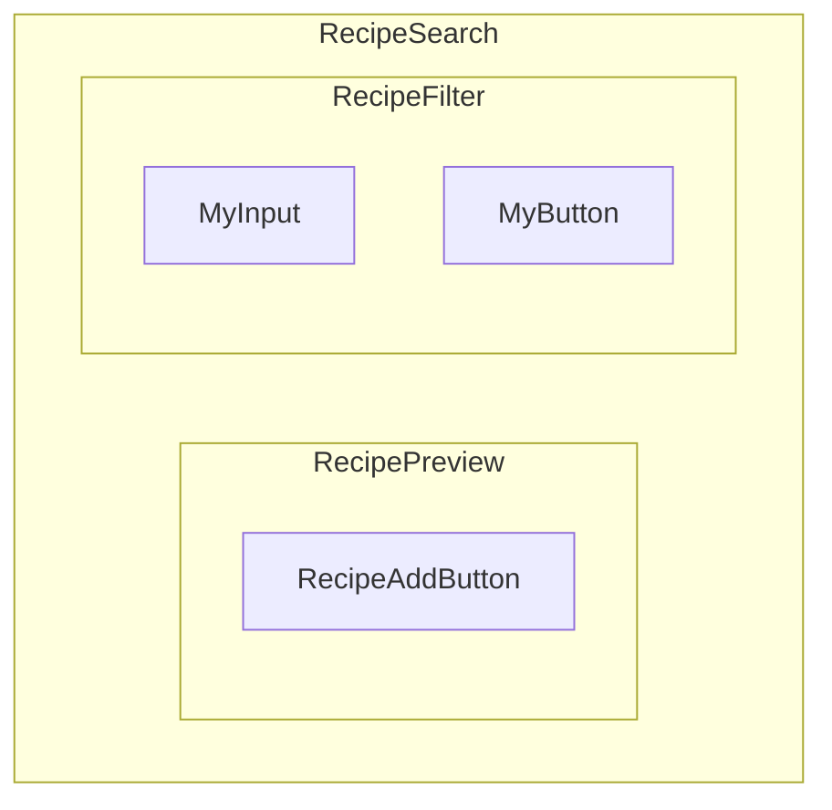

import { MegaQuote } from '@site/src/components/mega-quote';

One of the main concepts in Angular is that your application is split into a tree of components. Each component represents a reusable piece of the UI that:

- can contain other components — its children,
- communicates with its children through a defined contract,
- exposes a contract to its parent,
- keeps its state isolated from other components.

The main advantages of components are:

- **Reusability** — components are designed to be reusable.
- **Isolation** — components keep their implementation isolated from other components.
- **Separation of Concerns** — each component has a specific role and delegates work to other components.
- **Testability** — components help narrowing down tests.

All these elements are meant to make apps easier to maintain.

<MegaQuote>
  

    A Component controls a patch of screen real estate that we could call a
    view, and declares reusable UI building blocks for an application.
  

  

    — Brad Green <i>(but I'm not sure it was him 😅)</i>
  

</MegaQuote>

:::tip Kitchen Discipline Pays Off
Note that well crafted components are like a well organized fridge and kitchen, they will help you ship faster.
:::

## Example

Let's take our cooking app Whiskmate.

We can imagine the following component hierarchy:

