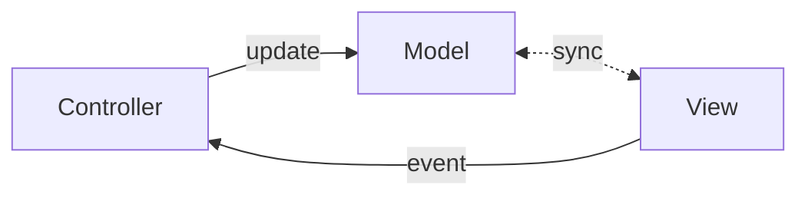

The mental model of Angular is the **View Model**. It's the bridge between your component's logic and the view.

While you can control the view imperatively, Angular encourages a declarative style built on synchronization between the model and the view.
There are many reasons for this, but here are some of them:

- It is easier to reason about the view when it is declarative.
- [Server-Side Rendering](https://angular.dev/guide/ssr) (SSR) and [Hydration](https://angular.dev/guide/hydration) are easier to implement when the view is declarative.

Here’s how it flows:

- The view emits an event.
- The controller _(your TypeScript class)_ [listens](../05-event-binding/index.md) and updates the model.
- Angular then updates the view, if needed, to reflect the new model.

In some cases, the controller is bypassed and the view updates the model directly — a mechanism known as **two-way data binding** _(hence the bidirectional "sync" arrow in the diagram above)_.
