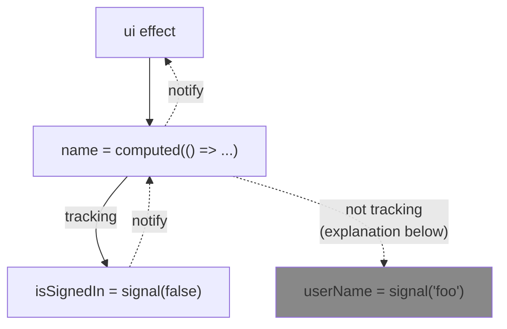

## What is a signal?

Signals are a concept that was borrowed from [SolidJS](https://www.solidjs.com/docs/latest/concepts/signals).

Their goal is to provide a **fine-grained reactivity mechanism that does not sacrifice Developer eXperience**.

In other words, they are meant to:

- Make the data flow more explicit.
- Optimize performance by helping Angular know exactly which data has changed, and which parts of the UI need to be synchronized.
- Keep the code readable and maintainable.

## Signal ingredients

There are three main signal primitives:

- [`signal()`](#signal)
- [`computed()`](#computed)
- [`effect()`](#effect)

### `signal()`

`signal()` is a signal factory function that creates a signal.

```ts
const count = signal(0);

count.set(1);

count.update((x) => x + 1);

console.log(count()); // 2
```

### `computed()`

`computed()` is a signal factory function that creates a computed signal.

A computed signal is a signal that is derived from one or more other signals.

```ts
const count = signal(0);

const doubleCount = computed(() => count() * 2);

count.set(2);

console.log(doubleCount()); // 4
```

### `effect()`

An effect is a special function that allows you to react to changes in signals.

:::warning Do not abuse `effect()`
There are rare cases that justify the direct use of `effect()`.
In most cases, either:

- **you do not need an effect at all**, and in that case, you propbably want to use `computed()` instead,
- or **you need another building block** that is using `effect()` internally _(e.g. [`linkedSignal()`](https://next.angular.dev/guide/signals/linked-signal) or [`resource()`](https://next.angular.dev/guide/signals/resource) — which is in Developer Preview as of v20)_.
  :::

## How it works?

Assume the following code:

```ts
const userName = signal('foo');
const isSignedIn = signal(false);
const name = computed(() => (isSignedIn() ? userName() : 'Guest'));

effect(() => {
  // DO NOT DO THIS IN REAL CODE
  document.body.textContent = name();
});
```

This produces the following signal graph:



Each signal is a node in a graph of signals.

Whenever you use a signal inside another signal _(e.g. in a `computed()` signal)_, you create a dependency between the two signals, **the "consumer" signal depends on the "producer" signal**.

Each time a producer changes, it notifies all of its consumers, and recursively, all of their consumers, and so on.

This way, the UI is updated only when necessary.

:::info Why is `name` not tracking `userName`?

As `isSignedIn()` is `false`. the `computed()` node never calls `userName()`. Therefore, the `computed()` node is not tracking `userName`.

Once `isSignedIn()` becomes `true`, the `computed()` node will be notified, will run, call `userName()`, and will start tracking it.
:::

<details>
<summary>🤿 Wanna deep dive? Here is an example implementation. Copy it, run it, and play with it.</summary>

Here is a simple implementation of the signal primitives.

It works but it is not complete as it serves only to illustrate the concept.

```ts
function homeMadeSignal(initialValue) {
  let value = initialValue;
  const node = _createNode();

  return {
    get: () => {
      node.addConsumer(activeConsumer);
      return value;
    },
    set: (v) => {
      if (v === value) {
        return;
      }
      value = v;
      node.notifyConsumers();
    },
  };
}

function homeMadeComputed(fn) {
  let isDirty = true;
  let value;
  const node = _createNode();
  node.onDependenciesChange(() => {
    isDirty = true;
    node.notifyConsumers();
  });

  return {
    get: () => {
      node.addConsumer(activeConsumer);

      if (isDirty) {
        _withActiveConsumer(node, () => {
          value = fn();
        });
        isDirty = false;
      }

      return value;
    },
  };
}

function homeMadeEffect(fn) {
  let queued = false;

  const node = _createNode();

  // Coalesce dependencies changes.
  node.onDependenciesChange(() => {
    if (queued) {
      return;
    }
    queued = true;
    queueMicrotask(() => {
      queued = false;
      _withActiveConsumer(node, fn);
    });
  });

  // Track dependencies.
  _withActiveConsumer(node, fn);
}

function _createNode() {
  let consumers = new Set();
  return {
    _callbacks: [],
    addConsumer: (consumer) => {
      if (consumer) {
        consumers.add(consumer);
      }
    },
    notifyConsumers: () => {
      consumers.forEach((consumer) =>
        consumer._callbacks.forEach((callback) => callback()),
      );
    },
    onDependenciesChange(callback) {
      this._callbacks.push(callback);
    },
  };
}

// Ambient context
let activeConsumer = null;
function _withActiveConsumer(self, fn) {
  const previousActiveConsumer = activeConsumer;
  activeConsumer = self;
  const result = fn();
  activeConsumer = previousActiveConsumer;
  return result;
}

const value = homeMadeSignal(0);
const double = homeMadeComputed(() => value.get() * 2);

homeMadeEffect(() => {
  console.log(double.get()); // 0, 6
});

value.set(2);
value.set(3);

setTimeout(() => {
  value.set(3);
});
```

</details>

## Additional Resources

- 📝 [**Signals Overview** by Angular](https://angular.dev/guide/signals)
- 📝 [**signal()** by Angular](https://angular.dev/api/core/signal)
- 📝 [**computed()** by Angular](https://angular.dev/api/core/computed)
- 📝 [**effect()** by Angular](https://angular.dev/api/core/effect)
