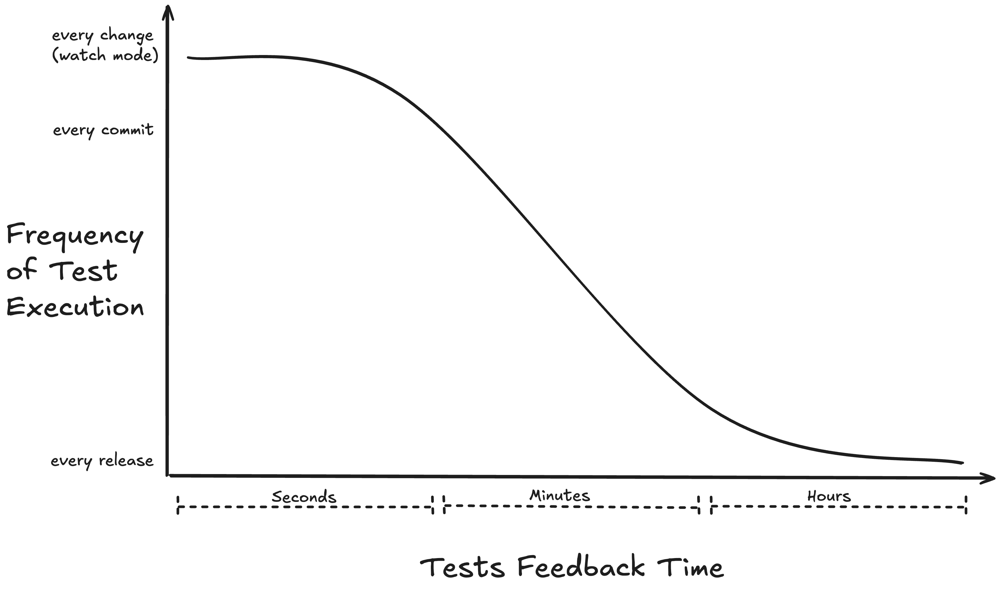

import { MegaQuote } from '@site/src/components/mega-quote';

Before diving any deeper, let's align on the testing categories we are going to discuss.

It is often agreed that there are three main testing categories:

- **Unit Tests**
- **Integration Tests**
- **End-to-End Tests** _(which can be seen as a subset of integration tests since they are nothing more than the largest integration tests possible)_

First of all, there is no universally accepted definition for these categories. _(Try asking your friends and colleagues to define them, then compare the results.)_

- **What is a unit?** Is it a unit of code, a functional unit, a cognitive unit?
- Is it still a unit test **if it uses a database**?
- Is it an **integration test** or a **sociable unit test** if it reuses something already tested instead of replacing it with a test double?

The line between unit and integration tests is blurry. While we could might be tempting to accept these ambiguities, it is important to understand that the distinction between these categories goes beyond mere semantics.

**This confusion is harmful**. It fuels dogmatic testing approaches and leads teams to adopt suboptimal strategies that slow them down or even discourage them from writing tests.

## 🐜 Narrow vs. 🐘 Wide

If we need categories, a more pragmatic approach is to define them based on test properties rather than dogmatic rules.

I will not provide new definitions for "unit" or "integration" tests for two key reasons:

- It can lead to friction instead of introducing a fresh perspective.
- More importantly, I think that beyond any definition, **the names "unit" and "integration" themselves are confusing**.

That is why I suggest using the following categories:

| Category            | Properties                                                                             |
| ------------------- | -------------------------------------------------------------------------------------- |
| **🐜 Narrow Tests** | ⚡️ Fast _(< ~100ms)_ 🏝️ Easy to isolate and parallelize 😌 Low cognitive load |
| **🐘 Wide Tests**   | 👆 Missing one of Narrow tests properties.                                             |

:::note
The Narrow vs. Wide categories resonated more effectively with the teams I’ve had the privilege of coaching over the past few years.
:::

## 🐜 Narrow Tests

Narrow tests are defined by the following properties:

### ⚡️ Fast

The goal of Narrow tests is to provide the **fastest feedback time while maintaining the highest level of confidence** possible. This is crucial in to maintain a high development speed.

The reasoning behind this is simple:

- 🐇 If the feedback time is **fast enough** _(less than few seconds)_, you are more likely to make **baby steps and see the impact of your changes immediately**, then continue or fix the last change.
- 🐢 If the feedback time is **too long**, you will run the tests less often, make bigger changes, then spend minutes or hours debugging the failing tests.

:::note
A similar behavior can be observed with web performance. I.e. **the conversion rate drops drastically when the Largest Contentful Paint _(LCP)_ is above a certain threshold**. _Cf.
[LCP & User Engagement Correlation](https://web.dev/case-studies/renault#optimized_lcp_strongly_correlates_with_user_engagement_and_business_metrics), [Why Speed Matters](https://web.dev/learn/performance/why-speed-matters), and [Web Vitals Business Impact](https://web.dev/case-studies/vitals-business-impact#why_core_web_vitals_matter_to_your_users_and_business)_
:::

#### How Fast!?

<MegaQuote>**TL;DR: The rule of thumb is less than ~100ms.**</MegaQuote>

In most cases, running tests in watch mode becomes irrelevant once the frequency of changes exceeds the feedback time. That is to say, if you make a change every 5-10 seconds, but the tests take 30 seconds to run, you will not run them in watch mode.

We need test feedback within seconds for rapid iteration and effective watch mode. But how does that scale?

Given that most modern build tools and testing frameworks provide ways to run only the tests affected by your changes, the feedback time can be further reduced. _e.g. [Nx Affected Graph](https://nx.dev/ci/features/affected#run-only-tasks-affected-by-a-pr), [Vitest's `changed` option](https://vitest.dev/guide/cli.html#changed)_.

In a well-designed product with a proper testing strategy, **most** changes should not affect more than a few hundred Narrow tests. Assuming that we run tests on 8 to 16 CPU cores, **each Narrow test should run in less than approximately 100ms** in order to run the affected Narrow tests in a few seconds: `300 (tests) * 100 ms / 10 (CPU Cores) = 3 seconds`

:::tip Key Takeaway
Test feedback speed correlates with development speed.
:::

:::warning Take ~100ms as a guideline, not a strict rule
What matters most is the **average** test feedback time.

Some changes might affect too many Narrow tests and it is okay as long as it is a rare occurrence.

Some Narrow tests might be a bit slower and it is okay. _(e.g. the first test in a test suite might suffer from a cold start)_

Some complex parts of your code might require thousands of Narrow tests, so you will want to reduce the threshold to something like `~10ms`.
:::

### 🏝️ Easy to Isolate and Parallelize

<MegaQuote>
  Narrow tests should be **isolated** and thus parallelizable **without
  effort**.
</MegaQuote>

Isolation and parallelization are fundamental pillars of a testing strategy.

If tests are not isolated enough, they can become hard to debug, or cause false negatives and false positives.
Also, if tests are not isolated, they can't be parallelized, thus slow.

:::note
Ideally, **even Wide tests should be isolated and parallelizable**. The main difference is that Wide test isolation can be relatively hard to achieve. e.g. you might need to create a distinct "user" or "workspace" per test, or some uniqueness constraints might force you to forge your testing data differently.
:::

If a group of tests are using a **shared resource that requires substantial effort** to avoid side effects between tests, **then these tests are Wide tests**.

#### Example: Is it still a Narrow test if it is using a Database?

If each test can have a distinct database populated with the necessary data without breaking the other properties: [Fast](#️-fast) & [Low Cognitive Load](#-low-cognitive-load), then it is a Narrow test.

For instance, it takes zero setup and [one line of code](https://github.com/typegoose/mongodb-memory-server/?tab=readme-ov-file#simple-server-start) to create an [In-Memory MongoDB Server](https://github.com/typegoose/mongodb-memory-server). Each worker could easily create its own MongoDB Server _(that starts in less than 500ms)_ then each test can create and populate a distinct database on this server in a few milliseconds.

On the other hand, **if isolation and parallelization are harder to achieve, then it is a Wide test**. Here are some examples:

- You have to share the same database between tests (due to some technical, billing, or licensing constraints).
- Creating a database server requires more effort (e.g. [test containers](https://testcontainers.com)), or more time to spin up.
- Populating the database requires more time.

### 😌 Low Cognitive Load

While speed and parallelization are vital properties, **the true cornerstone of Narrow tests is Low Cognitive Load**. This is the property that will help you define the boundaries of the System Under Test _(SUT)_.

The main principle is:

<MegaQuote>
  **Anyone** _(maintainers, contributors, future maintainers)_ should be able to
  **easily** locate the root cause of a failing test.
</MegaQuote>

Practically speaking, this means that a test involving a few straightforward Angular components and services could be considered a Narrow test,
while in some extreme cases, a test involving a single but highly complex function could be considered a Wide test.

:::tip Cognitive Load is Subjective
Cognitive load is a subjective property, thus **it is essential for a team to agree on what is considered a Low Cognitive Load**.
:::

:::warning
It is important to note that a smaller SUT does not necessarily mean a lower cognitive load.

Narrowing tests too much can lead to a high cognitive load due to the complexity of the test setup and test doubles orchestration.
:::

## 🐘 Wide Tests

Wide tests are tests that are missing one of the properties of Narrow tests.

They are **either**:

- 🐢 **slow**,
- 🔗 **harder to isolate**: tests are sharing resources that require substantial effort to avoid side effects between them,
- 🤯 or **harder to diagnose**: locating the root cause of a failing test requires significant effort or knowledge about the system _(e.g. when some information is missing in the UI, you might need to debug the UI, then a service, then the API, then the database, etc...)_.

Given Wide test properties, one might think that they should simply be avoided. However, Wide tests have their own advantages:

- They are more symmetric to production, and [predictive](https://testdesiderata.com/#:~:text=Predictive), thus more reassuring.
- They are more [structure-insensitive](https://testdesiderata.com/#:~:text=Structure%2Dinsensitive) _(e.g. you can refactor your code without breaking them)_.

## Which one to choose?

A sane testing strategy will have to balance between both categories.

We will discuss this in more detail in a future chapter.

## Additional Resources

- 📝 [**Unit Test** by Martin Fowler](https://martinfowler.com/bliki/UnitTest.html)
- 📝 [**Mocks Aren't Stubs** by Martin Fowler](https://martinfowler.com/articles/mocksArentStubs.html)
- 📝 [**Test Desiderata** by Kent Beck](https://testdesiderata.com/)
- 📺 [**Test Desiderata** by Kelly Sutton and Kent Beck](https://www.youtube.com/playlist?list=PLlmVY7qtgT_lkbrk9iZNizp978mVzpBKl)
