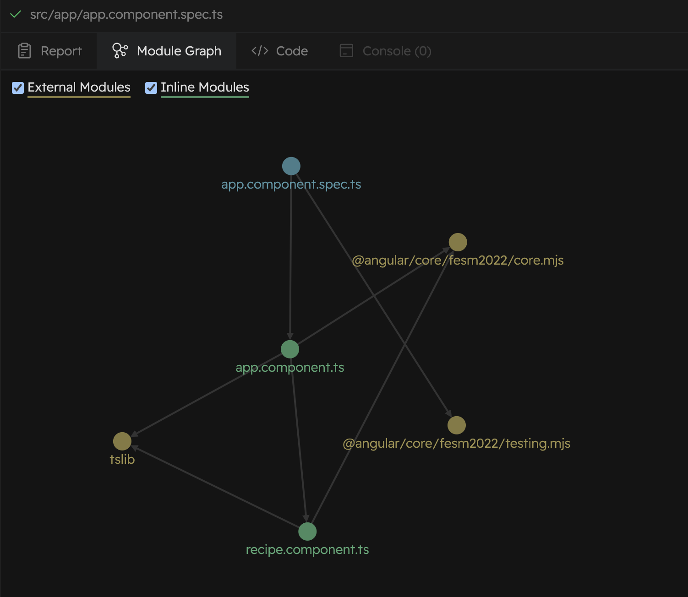

# Why Vitest?

There are many test runners and testing frameworks available in the web ecosystem, but let's focus on those that are most relevant to Angular developers.

Since the deprecation of [Karma](https://karma-runner.github.io/latest/index.html) in April 2023, the main alternatives in the Angular ecosystem are _(by alphabetical order)_:

- [Jest](https://jestjs.io/)
- [Vitest](https://vitest.dev/)
- [Web Test Runner](https://modern-web.dev/docs/test-runner/overview/) (_While promising, Web Test Runner is still in its early stages, so we will not consider it in this comparison._)

While both Jest and Vitest are mature and widely used in the web ecosystem, Jest has been massively adopted by the Angular community for many years. However, **Vitest is gaining traction and is fixing many of the pain points that Angular developers have been facing with Jest**.

Let's explore some of the reasons why you should consider using Vitest for your Angular projects.

## 📦 ESM Support

Vitest was designed with ECMAScript modules (ESM) compatibility in mind. This means that Vitest supports ESM out of the box. This is a big deal because Angular and the whole JavaScript ecosystem are moving towards ESM.

Beyond all the intrinsic advantages of ESM, **this means that Vitest does not require any configuration to downgrade ESM to CommonJS**, even for third-party libraries.

Haven't you ever been annoyed by the common `SyntaxError: Unexpected token 'export'` that you get when you forget to downgrade ESM to CommonJS in Jest, and the weird negative regex in [`transformIgnorePatterns`](https://jestjs.io/docs/configuration#transformignorepatterns-arraystring)?

- https://stackoverflow.com/questions/42260218/jest-setup-syntaxerror-unexpected-token-export
- https://stackoverflow.com/questions/49263429/jest-gives-an-error-syntaxerror-unexpected-token-export
- https://github.com/aws-amplify/amplify-js/issues/11435
- https://github.com/fullcalendar/fullcalendar/issues/7113

```js
transformIgnorePatterns: ['node_modules/(?!.*\\.mjs$)'];
```

:::warning
This also means that Jest "transform" phase will be slower than Vitest's because Jest will have to transform third-party libraries from ESM to CommonJS.
:::

:::tip What about Vitest?
**With Vitest, you won't have to deal with that anymore.**
:::

### Isn't Jest also moving towards ESM?

[**Jest ESM support is still experimental**](https://jestjs.io/docs/ecmascript-modules) as it relies on an experimental Node.js feature.

More precisely, Jest isolation model relies on Node.js [V8 Virtual Machines _(VM)_](https://nodejs.org/api/vm.html#vm-executing-javascript) where [ESM support is still experimental](https://nodejs.org/api/vm.html#vm_class_vm_module).

## 🏝️ Jest vs. Vitest Isolation Modes

### Jest Isolation Mode

**Jest has only a single isolation mode: VM**.

This means that Jest runs each test file in a separate Node.js VM.
Theoretically, this is the best trade-off between isolation and performance. However, in practice, this comes with a cost:

- As mentioned before, ESM support in VMs is still experimental in NodeJS.
- Conceptual memory leaks as third-party libraries can be reloaded in each VM, thus causing memory leaks to amplify:
  - https://chanind.github.io/javascript/2019/10/12/jest-tests-memory-leak.html
  - https://github.com/jestjs/jest/issues/6814
  - https://github.com/jestjs/jest/issues/14605
  - https://github.com/jestjs/jest/issues/7874

### Vitest Isolation Modes

Conversely, **Vitest offers [multiple isolation modes](https://vitest.dev/guide/improving-performance#test-isolation)**:

- **VM**: Each test file runs in a separate VM. _(just like Jest)_
- **Threads**: Each test file runs in a separate thread.
- **Forks**: Each test file runs in a separate process.
- **No Isolate**: All test files run in the same pool of threads or forks.

:::tip Choose the isolation mode that best fits your needs with Vitest
This means that with Vitest you can where you want to put the cursor between isolation and performance.
:::

In other words:

- **for most Angular tests you can disable the isolation in Vitest** to get the best performance. Angular's [`TestBed`](https://angular.dev/api/core/testing/TestBed?tab=api) provides a sufficient isolation mechanism.
- **for tests that require a higher level of isolation**, you can use `forks` isolation mode. This is the slowest but the most isolated mode. You can even make calls to `chdir` as this will only change the current directory for the process of the test file where this call is performed.

:::note
`TestBed` isolation mechanism and Angular's abstractions proved their efficiency with Karma. In fact, Karma runs all the tests in the same browser window.
:::

## ⚡️ Performance

When it comes to testing, the speed of feedback is crucial. You don't want to start multitasking while waiting for your tests to complete, or worse, to run them less frequently because they are too slow, right?

:::warning
Please note that the following performance comparison is based on a "lab" situation and may not reflect your specific use case. You should always run your own benchmarks to make an informed decision.
:::

This benchmark compares the performance of Jest with Vitest and its different isolation modes:

- `vitest-threads-no-isolate`: Vitest with threads and no isolation between different test files running in the same thread.
- `vitest-vmforks`: Vitest with fork workers and VM isolation between different test files running in the same process.
- `vitest-threads`: Vitest with thread workers running each test file in a separate thread.
- `vitest-forks`: Vitest with fork workers running each test file in a separate process.

_💻 The source code of the benchmark is available [here](https://github.com/yjaaidi/experiments/tree/angular-testing-benchmark)._

_📊 The last benchmark run results are available [here](https://github.com/yjaaidi/experiments/actions/workflows/benchmark.yml). (The disparity is even more significant when running the benchmark on Github Actions.)_

### Benchmark Cold Start

In this benchmark, Jest's and Angular's caches are cleared before each run to simulate a cold start.

| Command                        |      Mean [s] | Min [s] | Max [s] |    Relative |
| :----------------------------- | ------------: | ------: | ------: | ----------: |
| 🥇 `vitest-threads-no-isolate` | 2.925 ± 0.084 |   2.801 |   3.039 |        1.00 |
| 🥈 `vitest-vmforks`            | 4.761 ± 0.172 |   4.565 |   5.116 | 1.63 ± 0.08 |
| 🥉 `vitest-threads`            | 7.795 ± 0.356 |   7.549 |   8.771 | 2.67 ± 0.14 |
| `jest`                         | 8.282 ± 0.253 |   7.995 |   8.641 | 2.83 ± 0.12 |
| `vitest-forks`                 | 9.362 ± 0.259 |   8.999 |   9.792 | 3.20 ± 0.13 |

:::tip Conclusion
**Vitest can be up to **3x faster** than Jest.**
:::

### Benchmark Warm Start

In this benchmark, Jest's and Angular's caches are kept between runs to simulate a warm start.

| Command                        |      Mean [s] | Min [s] | Max [s] |    Relative |
| :----------------------------- | ------------: | ------: | ------: | ----------: |
| 🥇 `vitest-threads-no-isolate` | 2.945 ± 0.048 |   2.906 |   3.075 |        1.00 |
| 🥈 `vitest-vmforks`            | 4.768 ± 0.092 |   4.594 |   4.962 | 1.62 ± 0.04 |
| 🥉 `jest`                      | 4.775 ± 0.119 |   4.627 |   5.065 | 1.62 ± 0.05 |
| `vitest-threads`               | 7.581 ± 0.201 |   7.299 |   7.908 | 2.57 ± 0.08 |
| `vitest-forks`                 | 9.172 ± 0.131 |   8.930 |   9.385 | 3.11 ± 0.07 |
| `angular-cli-web-test-runner`  | 9.980 ± 0.074 |   9.828 |  10.095 | 3.39 ± 0.06 |

:::tip Conclusion
During the warm start, Jest leverages its cache to speed up the test execution.
In this case, Jest is as fast as Vitest with similar isolation mode but still 40% slower than Vitest without isolation.

As of today, Vitest does not have a cache mechanism, but the [Angular vite plugin could leverage Angular's cache](https://github.com/analogjs/analog/pull/1443) to speed up the test execution.
:::

### Watch Mode

:::info
Note that the current benchmark does not measure the `watch` mode where Vitest is known to shine with **5x to 10x faster feedback than Jest**.

This is decisive for Test-Driven Development _(TDD)_. 😇
:::

## 📝 Unified Configuration with Vite

Vitest can reuse the [Vite](https://vitejs.dev/) configuration. This means that whenever something is fixed or improved for the Vite dev server, you will be able to benefit from it in Vitest as well.
For instance, an official Angular plugin for Vite could partially reuse the [Vite configuration](https://github.com/angular/angular-cli/blob/4d437ec1930016ce972fc365bbb71d0607124e83/packages/angular/build/src/builders/dev-server/vite-server.ts) for Vitest.

## 🔮 Vitest Is Evolving Fast

While the Jest team is still [doing a great job](https://github.com/jestjs/jest/pulse/monthly), [Vitest is evolving faster](https://github.com/vitest-dev/vitest/pulse/monthly).

## 💻 Enhanced API

While Vitest covers the same features and APIs as Jest, making migration easier, Vitest also provides many additional APIs.

Here is a non-exhaustive list:

- [`expect.soft`](https://vitest.dev/api/expect.html#soft) that comes in handy when making multiple assertions in a single test.
- [`expect.poll`](https://vitest.dev/api/expect.html#poll) and [`vi.waitFor`](https://vitest.dev/api/vi.html#vi-waitfor) for retrying assertions. Note that retriability is one of the key features that made [Cypress](https://www.cypress.io/) and [Playwright](https://playwright.dev/) successful.
- [`stubGlobal`](https://vitest.dev/api/vi.html#vi-stubglobal) and [`stubEnv`](https://vitest.dev/api/vi.html#vi-stubenv) to override globals and env instead of handling them manually. _(It is better to avoid this by providing test doubles at an abstraction level you control but that's another story we'll cover later.)_
- [Fixtures](https://vitest.dev/guide/test-context.html#extend-test-context) just like Playwright.

## 🍱 Vitest is a Feature Buffet

### Type Testing

Vitest supports [type testing](https://vitest.dev/guide/testing-types.html) out of the box. This means that instead of compilation errors using TypeScript's [`@ts-expect-error`](https://www.typescriptlang.org/docs/handbook/release-notes/typescript-3-9.html#-ts-expect-error-comments), you can write type tests for your complex generics, conditional types, and more using a similar API to your regular tests.

```ts
test('create a serializer for the provided type', () => {
  const serializerFn = createSerializer<User>();
  expectTypeOf(serializerFn).parameter(0).toEqualTypeOf<User>();
  expectTypeOf(serializerFn).returns.toEqualTypeOf<string>();
});
```

This will also enhance your developer experience by providing an explicit Vitest test report for your type tests.

```sh
// highlight-next-line
FAIL  serializer.spec-d.ts > create a serializer with the provided type
TypeCheckError: Type 'string' does not satisfy the constraint '"Expected string, Actual void"'.
❯ serializer.spec-d.ts:6:52
  4|   const serializerFn = createSerializer<User>();
  5|   expectTypeOf(serializerFn).parameter(0).toEqualTypeOf<User>();
  6|   expectTypeOf(serializerFn).returns.toEqualTypeOf<string>();
   |                                                    ^
  7| });
```

### UI

Vitest provides a [UI](https://vitest.dev/guide/ui.html) to visualize your tests, their results, and their performance.

### Module Graph

What's even more compelling is that Vitest's UI provides a [module graph](https://vitest.dev/guide/graph.html) to visualize the dependencies between the modules loaded by your tests.



### Test Duration Report

While this might seem futile, Vitest provides a detailed test duration report. This is very useful to quickly identify the performance bottleneck.

```
Duration  2.77s (transform 952ms, setup 195ms, collect 1.02s, tests 802ms, environment 390ms, prepare 38ms)
```

- `prepare`: time spent preparing the test runner _(e.g. this will take much more time with the `forks` isolation mode compared to `no-isolate` mode)_.
- `transform`: time spent transforming the test files.
- `environment`: time spent setting up the test environment _(e.g. `happy-dom` or `jsdom` setup)_.
- `setup`: time spent executing the setup files.
- `collect`: time spent collecting the tests _(e.g. this includes the execution time of your test files code that is outside a `test`)_.
- `tests`: time spent executing the tests.

:::note
Note that the total duration is often lower than the sum of the parts due to parallelization.
:::

### Benchmarking _(experimental)_

Vitest also supports [benchmarking](https://vitest.dev/guide/features.html#benchmarking) out of the box. This means that you can write benchmarks for your functions and compare their performance over time.

### Browser mode _(experimental)_

This is one of the latest sweets from the Vitest buffet. [Vitest can run your tests in a real browser](https://vitest.dev/guide/browser/).

It is still experimental so it is still early to draw conclusions, but right now, we think that [Playwright Component Testing](https://github.com/jscutlery/devkit/tree/main/packages/playwright-ct-angular) approach is more suitable. We will elaborate on this in a future chapter.
