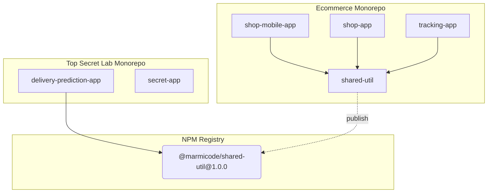

# How many repositories do you need?

A common misconception about Nx is that it will force us to regroup everything into a single monorepo.
As mentioned before in [Why Nx?](./01-why-nx.md), while Nx excels at managing monorepos, it offers many benefits even for repositories containing a single application maintained by a single developer.

You can apply Nx to each repository independently, and then mix and match by merging repositories and grouping them into one or multiple monorepos.

Here is a visual example of highly aligned teams sharing an "Ecommerce Monorepo" where some of their libraries are published to a registry, allowing other teams to use them in their own repositories or monorepos.

## Monorepo Grouping Strategy

The grouping strategy will mainly depend on the social structure of your company.
Interestingly, [Conway's Law](http://www.melconway.com/Home/Conways_Law.html) applies quite well here:

> Any organization that designs a system _(defined broadly)_ will produce a design whose structure is a copy of the organization's communication structure.

Indeed, monorepos require some rigor. **Different teams with different goals, visions, and engineering cultures may not be able to work together in a monorepo.**
For example, sharing a monorepo between two teams:

- one with a Continuous Deployment culture and a strong testing strategy,
- and one that has a monthly release cycle relying mostly on manual testing,

will likely result in chaos or frustration for at least one of the two teams, if not both.

## Monorepo Grouping Prerequisites

Here are some prerequisites for grouping repositories into a monorepo:

- **Engineering Culture Alignment**: Teams should have a similar engineering culture _(e.g. quality expectations, collective ownership, openness, knowledge sharing, ...)_. In other words, teams should be able to work together in a monorepo without being frustrated by the practices of other teams. Monorepos won't magically solve cultural issues; you should address cultural issues first.

- **Strong Conventions**: Teams should agree on a common set of rules and conventions.

- **Strong _(automated)_ Testing Strategy**: The testing strategy should instill enough confidence in all teams. If a single team lacks confidence in their tests, it may slow down the progress of other teams.

- **Automation**: In addition to tests, teams should be prepared to rely on automation in general. You will often use migration scripts to keep the monorepo up-to-date with the latest tooling.

- **Confidentiality Awareness**: Using Git, it is not possible to restrict read access per folder _(i.e. per app or lib)_. If a team is working on a project with a different confidentiality level, you might want to keep it in a separate repository.

- **_[Optional]_ Adhering to Single Version Policy**: Surprisingly, agreeing on a single version for each dependency used in the monorepo can make the code cheaper and easier to maintain, while keeping it up-to-date, secure, and less error-prone.

_This list is inspirational and not meant to be exhaustive._
