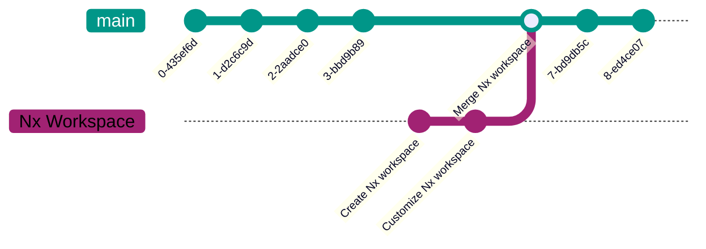

# Set Up Nx

## Creating an Nx Workspace

If you are fortunate enough to start a new project from scratch, then you can simply generate a new Nx workspace using the following command:

import NpmCommand from '@site/src/components/npm-command';

<NpmCommand args="create nx-workspace@latest <name> --preset <preset>" />

where `preset` is one of the following depending on your needs:

- `apps`: creates an empty workspace.
- `ts`: creates an empty workspace with TypeScript support.
- `angular|expo|express|nest|next|nuxt|react|react-native|vue`: creates a workspace with a single application using the framework of your choice.

:::warning
There is also the `npm` preset but we only recommend it if you **really** know what you are doing.

<details>
  <summary>Tell me more</summary>
  <div>
The `npm` preset creates an empty workspace with two main differences _(in order to align with the behavior of [Lerna](https://lerna.js.org/))_:

- the package manager is configured to install the dependencies described in each project's `package.json` (Cf. [PNPM Workspaces](https://pnpm.io/workspaces), [NPM Workspaces](https://docs.npmjs.com/cli/v8/using-npm/workspaces), [Yarn Workspaces](https://yarnpkg.com/features/workspaces)) which means that [Single Version Policy](../06-glossary.md#single-version-policy) will not be enforced.
- [`analyzeSourceFiles` option](https://nx.dev/recipes/tips-n-tricks/analyze-source-files) is set to `false` which means that Nx will not analyze the dependency graph between projects. This also means that Nx will not warn us if we forgot a dependency in a project's `package.json` _(Cf. [Dependency Checks Rule](https://nx.dev/nx-api/eslint-plugin/documents/dependency-checks))_.

Note that these two behaviors can be controlled separately.

Curious about NPM workspaces along with Nx?
Check out [Analog](https://github.com/analogjs/analog) & [RxJS](https://github.com/ReactiveX/rxjs) repositories.
Note that `analyzeSourceFiles` is set to `true` in both repositories.

</div>
</details>
:::

:::note
The exhaustive list of built-in presets is available here: [https://nx.dev/nx-api/nx/documents/create-nx-workspace#preset](https://nx.dev/nx-api/nx/documents/create-nx-workspace#preset).
:::

## Install Nx Globally

While this is optional, it is helpful to install Nx globally:

<NpmCommand
  args={{
    bun: 'add -g nx@latest',
    npm: 'install -g nx@latest',
    pnpm: 'add -g nx@latest',
    yarn: 'global add nx@latest',
  }}
/>

:::info
Note that the global `nx` command will always use the workspace's version of Nx.

You don't have to worry about version mismatch.
:::

## Standalone vs. Integrated

With most presets, you will be asked to choose between a **Standalone** or an **Integrated Monorepo** workspace.

```sh
> Integrated monorepo, or standalone project? …
Integrated Monorepo:  Nx creates a monorepo that contains multiple projects.
Standalone:           Nx creates a single project and makes it fast.
```

**Standalone** mode will create an application at the **root of the workspace**. The file structure would look something like this:

```
├── README.md
├── index.html
├── nx.json
├── package.json
├── project.json
├── src
│   ├── app
│   │   ├── app.spec.ts
│   │   └── app.ts
│   └── main.ts
├── tsconfig.app.json
├── tsconfig.json
├── tsconfig.spec.json
└── vite.config.ts
```

It will also add scripts like `build`, `start`, and `test` to the `package.json` file.

**Integrated Monorepo** mode will create the application in the `apps` directory and create a `tsconfig.base.json` that all projects will extend from. The file structure would look something like this:

```sh
├── README.md
# highlight-next-line
├── apps               👈
# highlight-next-line
│  └── marmicode       👈
│      ├── index.html
│      ├── project.json
│      ├── src
│      │  ├── app
│      │  │  ├── app.spec.ts
│      │  │  ├── app.ts
│      │  └── main.ts
│      ├── tsconfig.app.json
│      ├── tsconfig.json
│      ├── tsconfig.spec.json
│      └── vite.config.ts
├── nx.json
├── package.json
# highlight-next-line
└── tsconfig.base.json 👈
```

:::tip
Note that you can always switch from **Standalone** to **Integrated Monorepo** later on using the `@nx/workspace:convert-to-monorepo` generator:

```sh
nx g convert-to-monorepo
```

or by moving the application to the `apps` directory using the `@nx/workspace:move` generator:

```sh
nx g move --projectName <name> --destination apps/<name>
```

_Make sure to add the `@nx/workspace` plugin:_

```sh
nx add @nx/workspace
```

:::

:::tip
Prefer **Integrated Monorepo** mode over **Standalone**.

In our experience, **Standalone** workspaces eventually end up being migrated to **Integrated Monorepo**.

In addition to this, note that even though it is possible to move the application using `@nx/workspace:move` generator later on, the process is not magic and might miss some things like files added after the initial creation. _(e.g. docs, test setup files, etc...)_
:::

## Migrating to Nx

If you are migrating an existing project to Nx, you have two options:

- [Add Nx to an existing workspace](#option-1-add-nx-to-an-existing-workspace).
  - 🍰 Simple.
  - 🪜 More progressive.
  - 🫤 Not symmetric to starting from scratch.
- [Create a new Nx workspace and move existing code into it](#option-2-merge-a-new-nx-workspace-into-an-existing-repository).
  - 👯 Symmetric to starting from scratch.
  - 💪 Get all the advantages of using Nx from day 1.
  - 😓 Less progressive and might require a bit more work than just running a command.

**If you don't have a complex setup, we recommend the second option**. In fact, the second option will provide a better starting point. _(e.g. `nx init` will not set up a linter for you, but creating a new workspace will.)_

### Option 1: Add Nx to an Existing Workspace

Given an existing repository, we can add Nx to it using the following command:

```sh
nx init --integrated
```

_Note that the `--integrated` option will only work on Angular CLI workspaces and Create React App (CRA) projects._

While this command works pretty well in most common cases, it is not perfect because:

- it will generally reuse existing npm scripts (e.g. `build`, `start`, `test`, etc...) which might not be optimal compared to what Nx executors can offer,
- it will prompt you to choose which of these scripts are cacheable and what are their outputs, but it will not ask about their inputs which we would have to configure later on in the `nx.json` file,
- the final result will not be exactly aligned with an Nx workspace created from scratch.

:::tip
We recommend [creating a new Nx workspace and moving existing code into it](#option-2-merge-a-new-nx-workspace-into-an-existing-repository).
:::

### Option 2: Merge a new Nx workspace into an existing repository

If you are migrating an existing repository to Nx, you can create a new Nx workspace and merge it into the existing repository.

This approach gives you more control while keeping you aligned with Nx defaults just as if you were starting a new project from scratch.

#### Step 1 - [Create a new Nx workspace](#creating-an-nx-workspace)

<NpmCommand args="create nx-workspace@latest <name> --preset <preset>" />

#### Step 2 - Merge the new Nx workspace into the existing repository



Go to your existing repository and merge the new Nx workspace into it:

```sh
# Add the new Nx workspace as a remote.
git remote add nx-workspace <path|url>

# Merge the new Nx workspace into the existing repository.
git fetch nx-workspace
git merge nx-workspace/main --allow-unrelated-histories
```

:::tip
The trick here resides in the `--allow-unrelated-histories` option which will allow you to merge two unrelated repositories.
:::

#### Step 3 - Fix conflicts

You will most likely have conflicts to resolve. We recommend doing this using mob programming with your team.

We also recommend keeping Nx defaults as much as possible and only changing what is really necessary. The less you change, the less you diverge, and the easier it will be to upgrade Nx in the future.

#### Step 4 - Move app's source code into dedicated directory

If your existing repository has an app at the root, we recommend moving its source code into the `apps/<name>` directory created when generating the Nx workspace.

:::note
This makes it clear whether a file _(configuration, documentation etc...)_ is specific to the app or to the whole workspace. It will also make things easier in the long run _(e.g. configuring caching, adding apps/libs)_.
:::

## Using Nx

You can now run the Nx task of your choice to build, test or serve your applications.

List the projects in your workspace using the following command:

```sh
nx show projects
```

List the available targets for a specific project using the following command:

```sh
nx show project <project-name> --web
```

:::note
Learn more about Nx tasks in the [Nx documentation](https://nx.dev/features/run-tasks#run-tasks).
:::
