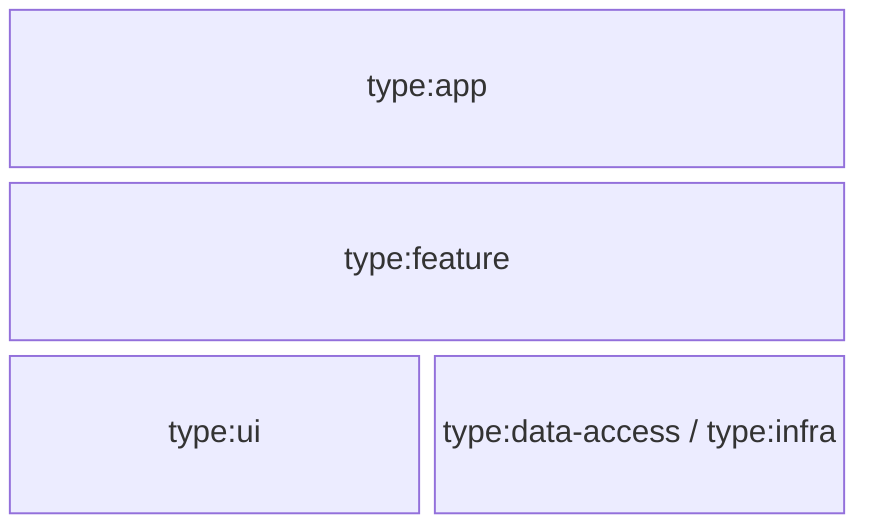
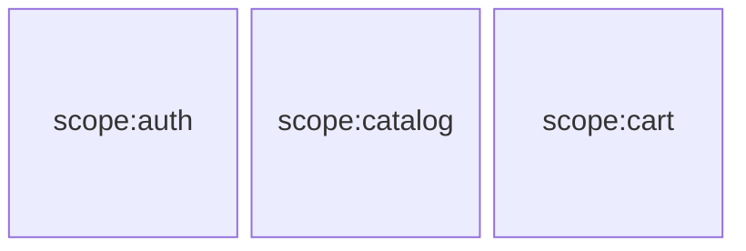
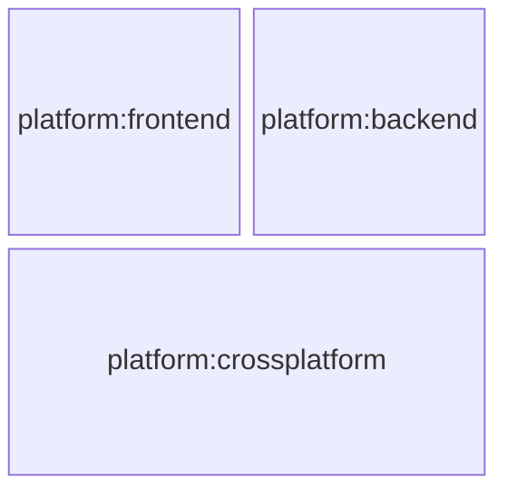
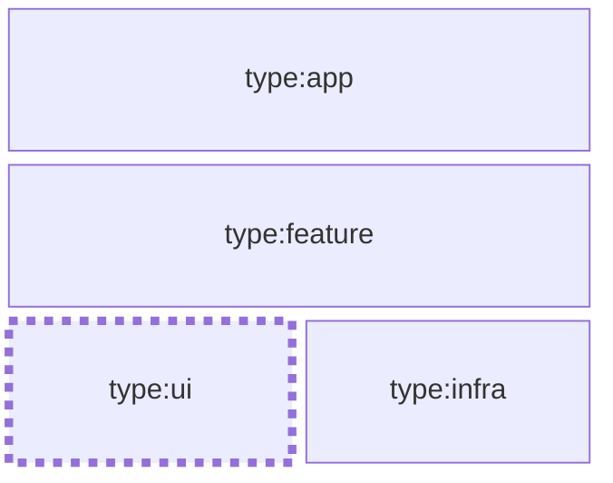
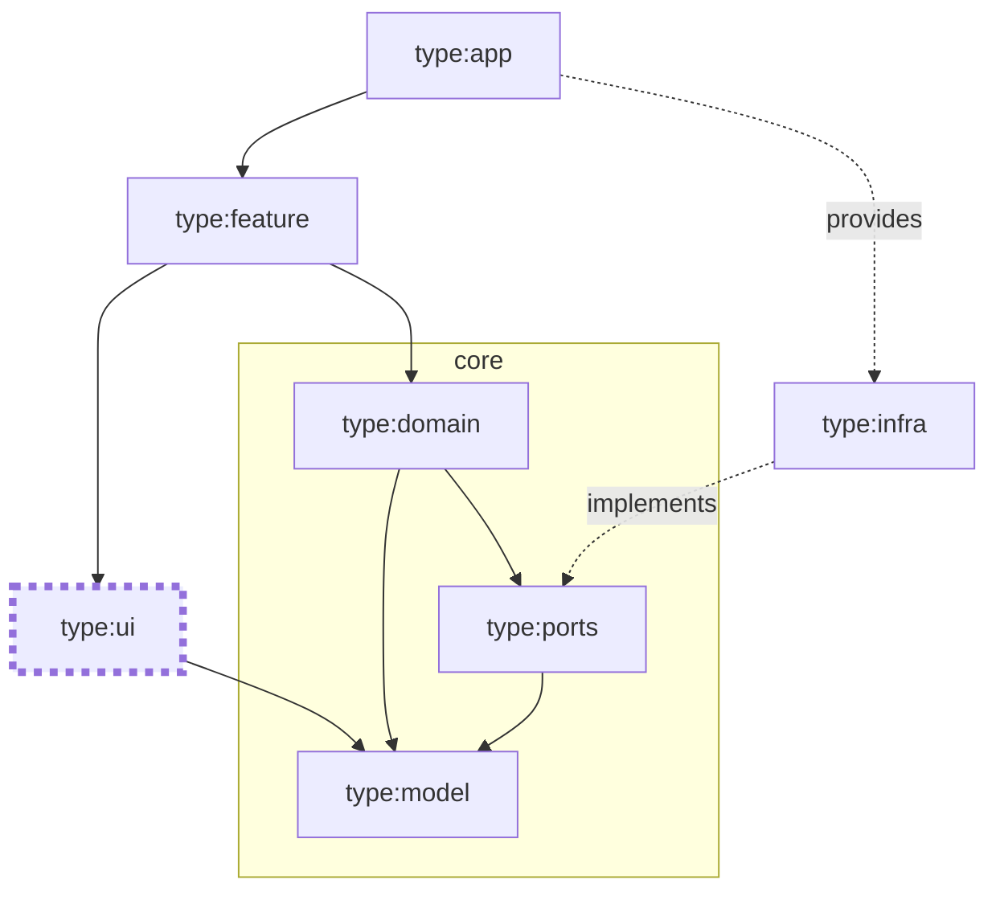
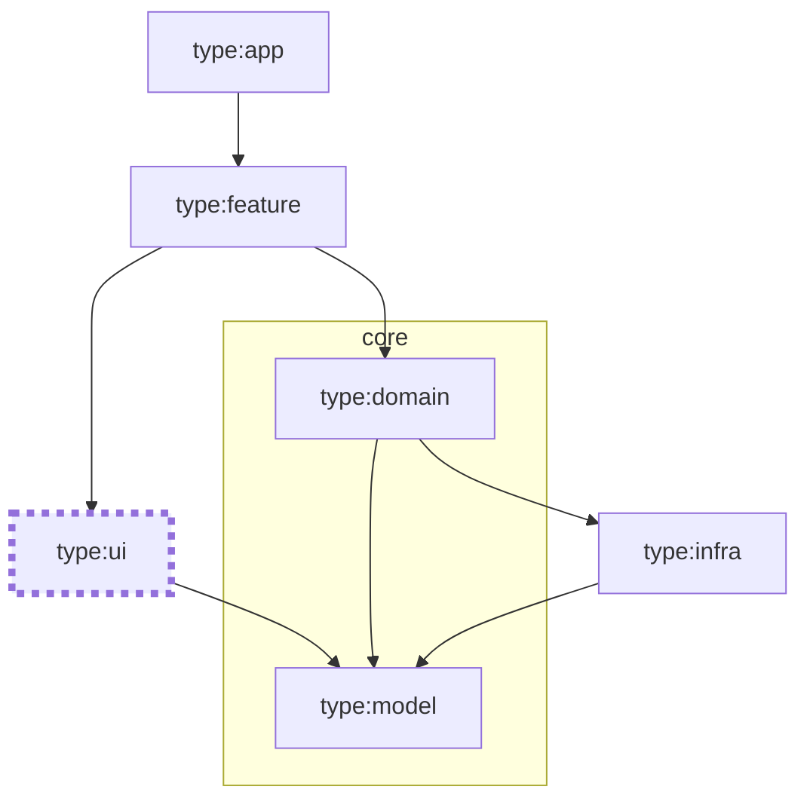

# Organizing Libraries

Now that you've decided to divide your apps into libraries, you might have a few questions in mind:

- How should we organize these libraries?
- How should we categorize them?
- How should we name them?
- How granular should they be?

While there is no one-size-fits-all answer to these questions, here is some guidance to help you make informed decisions.

## Library Categorization

You are free to organize your libraries in any way that makes sense to you, your team, and your organization.
However, it is essential to define some rules to avoid ending up with a mess of libraries that are hard to understand and maintain.
In addition, this will allow us to leverage certain [Nx features that will enforce these rules](./03-boundaries.md) and assist everyone on the team in following them.

### Tags & Categories

Nx allows us to tag our applications and libraries with custom tags.

These tags can be provided when the application or library is generated using the `--tags` option:

```sh
nx g lib my-lib --tags=my-category
```

or afterwards by updating the `tags` property in the `project.json` file:

```json
{
  "name": "my-lib",
  "tags": ["my-category"],
  ...
}
```

Tags can be used to categorize libraries based on different criteria. They are useful for:

- [enforcing boundaries and architectural rules](./03-boundaries.md),
- or simply running tasks on specific categories of apps and libraries
  _(e.g. `nx run-many -t test --projects=tag:my-category`)_,

### Type Categories

The first group of categories that can help you organize your libraries across various architectural styles is the `type` category group.

This group is commonly used to define **horizontal layers**, or in other words, to **segregate the technical responsibility** of the library _(e.g., container components vs. presentational components for the frontend, or controllers vs. repositories for the backend)_. Some common type categories are `feature`, `ui`, `data-access`, or `infra`. These are just examples that will be elaborated on [below](#library-categorization-examples).

:::note
The naming convention in the Nx community is to prefix the tags with `type:` _(e.g. `type:ui`)_.
:::



### Scope categories

The second most common group of categories that can help you organize your libraries is the `scope` category group.

It represents the **vertical slices** of the workspace. Essentially, it **segregates the functional responsibilities** of applications and libraries.

For example, given a recipe catalog application, you could have the following scopes: `auth`, `catalog`, and `cart`.



If you are familiar with the Bounded Context of Domain-Driven Design _(cf. https://martinfowler.com/bliki/BoundedContext.html or https://www.amazon.com/Domain-Driven-Design-Tackling-Complexity-Software/dp/0321125215)_, you can view the **`scope` category group as a tactical approach to defining the boundaries of a bounded context**.

If you're unfamiliar with this concept, consider it as a way to define the scope of a specific set of functional responsibilities. It establishes the boundaries within which certain concepts, terms, and business rules apply, allowing you to focus on the task at hand without distractions from other parts of the workspace. More precisely, **a bounded context defines the boundaries where a particular model is applicable**.

### Other Categories

In larger workspaces, you might want to define additional categories to help you organize your applications and libraries.

For instance, the `platform` category group is commonly used to define the platform on which the application or library is intended to run: `frontend`, `backend`, `crossplatform`, etc...



In even larger workspaces and organizations, you might want to define the `department` or `team` category group to identify the department or team that owns the application or library: `sales`, `marketing`, `finance`, etc.

## Library Type Categorization Examples

As mentioned [above](#library-categorization), you are free to organize your libraries in any way that makes sense to you. However, determining or agreeing on the categories to use, especially the type categories, can be challenging. To help you get started, here are some examples:

### Light Layered Architecture

For the simplest workspaces and for small teams that can properly apply separation of concerns without enforcing any boundaries, you might want to consider a simple layered architecture like this one. However, remember that merging libraries is often easier than splitting them.



| Type      | Description                                   | Content                                                                                                                                                                                                                                                                                       |
| --------- | --------------------------------------------- | --------------------------------------------------------------------------------------------------------------------------------------------------------------------------------------------------------------------------------------------------------------------------------------------- |
| `app`     | An application.                               | **Frontend:**<br/>✅ App configuration.<hr/>**Backend:**<br/>✅ App configuration.<br/>✅ Controllers.<br/>✅ Serverless handlers.                                                                                                                                                            |
| `feature` | Feature-specific logic.                       | **Frontend:**<br/>✅ Page components.<br/>✅ Container components.<br/>✅ Facades.<br/>✅ Services.<br/>✅ State management, stores, and effects.<br/>🛑 Almost no styling except for some layout.<hr/>**Backend:**<br/>✅ Use cases.<br/>✅ Services.                                        |
| `ui`      | Abstraction layer of the UI.                  | **Frontend:**<br/>✅ Presentational _(a.k.a. dumb)_ components.<br/>✅ UI services _(e.g. Dialog)_.<hr/>**Backend: -**                                                                                                                                                                        |
| `infra`   | Abstraction layer of infrastructure concerns. | **Frontend:**<br/>✅ Repositories or remote service adapters _(e.g. HTTP, or GraphQL clients)_.<br/> ✅ Non-UI browser API adapters _(e.g. Speech Recognition)_<hr/>**Backend:**<br/>✅ Remote service adapters _(e.g. HTTP, or GraphQL clients)_.<br/> ✅ Repositories or database adapters. |

#### Pros and Cons

- ✅ This architecture style is straightforward and easy to understand.
- ❌ It has the tendency to contaminate upper layers with infrastructure concerns. _(e.g. Remote service types (DTOs) can be propagated to the `feature` layer.)_

:::note
With this architecture, you will quickly notice the need for a `model` layer to share the domain model between the `feature`, `infra`, and `ui` layers.
:::

### Hexagonal-Inspired Architecture

For the most complex workspaces or for large teams who want to enforce strict separation of concerns, you might want to consider a hexagonal-inspired architecture similar to this one.



| Type      | Description                                                                                        | Content                                                                                                                                                                                                                                                                                                                                                                |
| --------- | -------------------------------------------------------------------------------------------------- | ---------------------------------------------------------------------------------------------------------------------------------------------------------------------------------------------------------------------------------------------------------------------------------------------------------------------------------------------------------------------- |
| `app`     | An application.                                                                                    | **Frontend:**<br/>✅ App configuration.<hr/>**Backend:**<br/>✅ App configuration.<br/>✅ Controllers.<br/>✅ Serverless handlers.                                                                                                                                                                                                                                     |
| `feature` | Feature-specific logic.                                                                            | **Frontend:**<br/>✅ Page components.<br/>✅ Container components.<br/>🛑 Almost no styling except for some layout.<hr/>**Backend:**<br/>✅ Use cases or feature-specific services.                                                                                                                                                                                    |
| `domain`  | Reusable business logic.                                                                           | **Frontend:**<br/>✅ Facades.<br/>✅ Reusable services.<br/>✅ State management, stores, and effects.<br/>✅ Ports injection tokens.<hr/>**Backend:**<br/>✅ Reusable services.<br/>✅ Ports injection tokens.                                                                                                                                                         |
| `model`   | The model applicable inside a given bounded-context _(cf. [Scope categories](#scope-categories))_. | **Frontend:**<br/>✅ Entities generally formed by the combination of interfaces/types/enums/functions.<br/>🛑 Almost no external dependencies.<br/>🛑 Framework-agnostic code only.<hr/>**Backend:**<br/>✅ Entities: classes or interfaces & functions.<br/>🛑 Almost no external dependencies.<br/>🛑 Framework-agnostic code only.                                  |
| `ports`   | Infrastructure abstraction.                                                                        | ✅ Ports: interfaces abstracting the infrastructure.<br/>🛑 Almost no external dependencies.<br/>🛑 Framework-agnostic code only.                                                                                                                                                                                                                                      |
| `ui`      | Abstraction layer of the UI.                                                                       | **Frontend:**<br/>✅ Presentational _(a.k.a. dumb)_ components.<br/>✅ UI services _(e.g. Dialog)_.<hr/>**Backend: -**                                                                                                                                                                                                                                                 |
| `infra`   | Infrastructure implementation.                                                                     | **Frontend:**<br/>✅ Adapters implementing ports.<br/>✅ Repositories or remote service adapters _(e.g. HTTP, or GraphQL clients)_.<br/> ✅ Non-UI browser API adapters _(e.g. Speech Recognition)_.<hr/>**Backend:**<br/>✅ Adapters implementing ports.<br/>✅ Remote service adapters _(e.g. HTTP, or GraphQL clients)_.<br/> ✅ Repositories or database adapters. |

#### Pros and Cons

- ✅ This architecture style enforces strict separation of concerns.
- ✅ It prevents the contamination of the application's core with infrastructure concerns. _(e.g. changes to remote services have less impact and require less refactoring/restructuring.)_
- ✅ It can simplify testing.
- ✅ It can speed up some tests by not loading the `infra` category and its dependencies, and also thanks to Nx graph, Nx will not rerun `domain`, `feature` or `core` tests when `infra` category is the only one that changed.
- ❌ It is more complex and might be overkill for small teams or simple applications.
- ❌ Dependency inversion can defeat the purpose of tree-shakability _(i.e., services must be provided when the app or feature is loaded)_. This can lead to larger bundles, potentially harming performance for both frontend and backend applications. Indeed, providing unnecessary infrastructure services in the backend can result in slower deployment and more significant cold starts.
- ❌ The dependency inversion requires more boilerplate in this case. _(i.e. injection token + interface + implementation.)_

:::tip
`ports` can be merged with `model` if you want to keep the number of libraries to a minimum.
:::

:::note note about injection tokens location
Note that injection tokens are in the `domain` category to prevent implementations in `infra` from injecting other ports by mistake.
This also applies to `ui` if `ports` and `model` are merged: if the tokens are in `model`, `ui` could inject infrastructure services.
:::

### Modular Layered Architecture

The example below is a layered architecture with fine-grained horizontal slices that emphasize both separation of concerns and simplicity.
It is a balance between the two previous examples.



| Type      | Description                                                                                        | Content                                                                                                                                                                                                                                                                                                                                                                |
| --------- | -------------------------------------------------------------------------------------------------- | ---------------------------------------------------------------------------------------------------------------------------------------------------------------------------------------------------------------------------------------------------------------------------------------------------------------------------------------------------------------------- |
| `app`     | An application.                                                                                    | **Frontend:**<br/>✅ App configuration.<hr/>**Backend:**<br/>✅ App configuration.<br/>✅ Controllers.<br/>✅ Serverless handlers.                                                                                                                                                                                                                                     |
| `feature` | Feature-specific logic.                                                                            | **Frontend:**<br/>✅ Page components.<br/>✅ Container components.<br/>🛑 Almost no styling except for some layout.<hr/>**Backend:**<br/>✅ Use cases or feature-specific services.                                                                                                                                                                                    |
| `domain`  | Reusable business logic.                                                                           | **Frontend:**<br/>✅ Facades.<br/>✅ Reusable services.<br/>✅ State management, stores, and effects.<hr/>**Backend:**<br/>✅ Reusable services.                                                                                                                                                                                                                       |
| `model`   | The model applicable inside a given bounded-context _(cf. [Scope categories](#scope-categories))_. | **Frontend:**<br/>✅ Entities generally formed by the combination of interfaces/types/enums/functions.<br/>🛑 Almost no external dependencies.<br/>🛑 Framework-agnostic code only.<hr/>**Backend:**<br/>✅ Entities: classes or interfaces & functions.<br/>🛑 Almost no external dependencies.<br/>🛑 Framework-agnostic code only.                                  |
| `ui`      | Abstraction layer of the UI.                                                                       | **Frontend:**<br/>✅ Presentational _(a.k.a. dumb)_ components.<br/>✅ UI services _(e.g. Dialog)_.<hr/>**Backend: -**                                                                                                                                                                                                                                                 |
| `infra`   | Infrastructure implementation.                                                                     | **Frontend:**<br/>✅ Adapters implementing ports.<br/>✅ Repositories or remote service adapters _(e.g. HTTP, or GraphQL clients)_.<br/> ✅ Non-UI browser API adapters _(e.g. Speech Recognition)_.<hr/>**Backend:**<br/>✅ Adapters implementing ports.<br/>✅ Remote service adapters _(e.g. HTTP, or GraphQL clients)_.<br/> ✅ Repositories or database adapters. |

#### Pros and Cons

- ✅ This architecture style plays well with tree-shakability. Infrastructure services do not have to be provided explicitly, they can be implicitly provided when used. _(e.g. Angular's `providedIn: 'root'`, or React's context's default value.)_
- ❌ It can't easily enforce that upper layers are not contaminated by infrastructure concerns. _(i.e. Remote service types (DTOs) can be propagated to the `domain` or `feature` layer.)_

:::tip
By implementing infrastructure service interfaces in the `model` layer, you will reduce the risk of contaminating the `domain` and `feature` layers by infrastructure concerns without adding too much complexity and without losing tree-shakability.

In other words, as `model` is not allowed to import types from `infra` so the interfaces it defines will be infrastructure-agnostic.
:::

## Choosing the Right Granularity

Deciding on the right granularity for your libraries is crucial: if they're too big, you lose some of the benefits of splitting your apps into libraries; if they're too granular, you might introduce unnecessary complexity.

### Too Big

Creating excessively large libraries could diminish some of the benefits of splitting apps into libraries:

- It could result in a monolithic library that is challenging to maintain and understand.
- It might not fully leverage Nx's caching and parallelization capabilities.
- Progressive migration could become more difficult (e.g., transitioning from Jest to Vitest, or changing lint or build options).

### Too Granular

On the other hand, creating excessively granular libraries might introduce unnecessary complexity:

- It could increase the cognitive load for developers who might struggle to understand the purpose of each library.
- It will require more boilerplate as each new symbol must be re-exported by the library's public API _(i.e., `index.ts`)_ before being used in other apps and libraries.
- It might defeat the purpose of parallelization by over-parallelizing.
- Without [enforcing the boundaries](./03-boundaries.md), it could lead to highly coupled libraries or libraries that export implementation details.

### The Right Size

Before deciding on the granularity of your libraries, here are some important factors to consider:

- **Workspace Ambitions**: What are the goals of your workspace? Is it a small isolated application that is not meant to last, or is it a long-term product that will evolve over time? Are you planning to merge other repositories into this workspace?
  For instance, in the extreme case where one or two developers are building a small isolated application that is not meant to last, you might not need to split it into libs.

- **Team's Experience**: How experienced is your team with the technologies and architectural styles you are using?
  Paradoxically, if the separation of concerns is not natural to your team, creating many libraries with clear and enforced boundaries will help them understand and apply the architecture better.

:::note
While you can always start with relatively large libraries and gradually split them into smaller ones, note that it is generally easier to merge libraries than to split them. 😉
:::

## Defining your Architecture

Before choosing an architectural style and the corresponding categories, consider the following:

- Make sure to **involve your team in the decision-making process**.
- **Avoid dogmatism**: the best architecture is the one that fits your team, your workspace, and your organization.
- You are free to **mix and match**, but make sure that you have a clear understanding of the trade-offs _([see the pros and cons of each example above](#library-type-categorization-examples))_.
- Listen to the signals:
  - If you notice that some libraries are growing too large, consider splitting them into smaller ones.
  - If you notice the proliferation of passthrough libraries _(a.k.a. Sinkhole Anti-Pattern)_, then you might want to simplify your architecture.
  - If your team struggles to understand the architecture, then you might want to simplify it.
  - If your team struggles to maintain a clear separation of concerns, then you might want to try a more restrictive architecture.

:::warning Mind the Sinkhole!
In order to avoid what is often referred to as the **"Sinkhole Anti-Pattern"**, note that you do not have to always implement all the type categories.
For instance, a really simple application without much business logic might only need the `app`, `ui`, and `infra` categories.

Also, in the same workspace, some [scope](#scope-categories) slices might need less layers than others.
:::

## Additional resources

- Enterprise Angular by Manfred Steyer: https://www.angulararchitects.io/en/ebooks/micro-frontends-and-moduliths-with-angular/
- Bounded Context by Martin Fowler (2014): https://martinfowler.com/bliki/BoundedContext.html
- Domain Driven Design: Tackling Complexity in the Heart of Software by Eric Evans (2003): https://www.amazon.com/Domain-Driven-Design-Tackling-Complexity-Software/dp/0321125215
- Hexagonal Architecture by Alistair Cockburn (2005): https://alistair.cockburn.us/hexagonal-architecture/
- Onion Architecture by Jeffrey Palermo (2008): https://jeffreypalermo.com/2008/07/the-onion-architecture-part-1/
