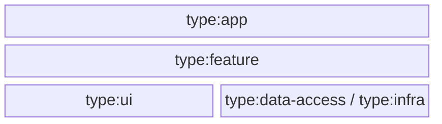
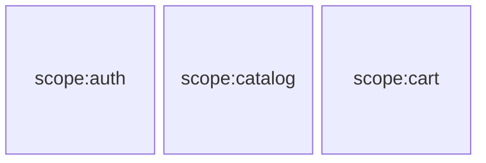
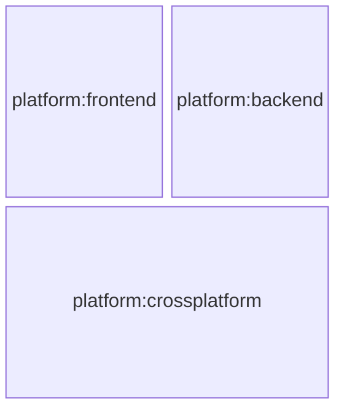

# 🚧 Organize libs

Now that you've decided to split your apps into libraries, you might already have a couple of questions in mind:

- how should we organize these libraries?
- how should we categorize them?
- how should we name them?
- how granular should they be?

While there is no one-size-fits-all answer to these questions, here is some guidance to help you make informed decisions.

## Choosing the right granularity

Deciding on the right granularity for your libraries is crucial: too big, and you lose some of the benefits of splitting your apps into libraries; too granular, and you might introduce useless complexity.

### Too big

Creating excessively large libraries could diminish some of the benefits of splitting apps into libraries:

- It could result in a monolithic library that is challenging to maintain and understand.
- It might not fully leverage Nx's caching and parallelization capabilities.
- Progressive migration could become more difficult (e.g., transitioning from Jest to Vitest, or changing lint or build options).

### Too granular

On the other hand, creating excessively granular libraries might introduce unnecessary complexity:

- It could increase the cognitive load for developers who might struggle to understand the purpose of each library.
- It will require more boilerplate as each new symbol must be re-exported by the library's public API _(i.e. `index.ts`)_ before being used in other apps and libraries.
- It might defeat the purpose of parallelization by over-parallelizing.
- It could lead to highly coupled libraries or libraries that export implementation details.

### The right size

Before deciding on the granularity of your libraries, here are some important factors to consider:

- **Workspace ambitions**: what are the goals of your workspace? Is it a small isolated application that is not meant to last, or is it a long-term product that will evolve over time? Are you planning to merge other repositories into this workspace?
  For instance, in the extreme case where one or two developers are building a small isolated application that is not meant to last, you might not need to split it into libs.

- **Team's experience**: how experienced is your team with the technologies and architectural styles you are using?
  Paradoxically, if the separation of concerns is not natural to your team, creating many libraries with clear and enforced boundaries will help them understand and apply the architecture better.

:::note
While you can always start with relatively large libraries and gradually split them into smaller ones, note that it is generally easier to merge libraries than to split them. 😉
:::

## Library categorization

You are free to organize your libraries in any way that makes sense to you, your team, and your organization.
However, it is essential to define some rules to avoid ending up with a mess of libraries that are hard to understand and maintain.
In addition, this will allow us to leverage certain [Nx features that will enforce these rules](./03-boundaries.md) and assist everyone on the team in following them.

### Tags & Categories

Nx allows us to tag our applications and libraries with custom tags.

These tags can be provided when the application or library is generated using the `--tags` option:

```sh
nx g lib my-lib --tags=my-category
```

or afterwards by updating the `tags` property in the `project.json` file:

```json
{
  "name": "my-lib",
  "tags": ["my-category"],
  ...
}
```

Tags can be used to categorize libraries based on different criteria. They are useful for:

- [enforcing boundaries and architectural rules](./03-boundaries.md),
- or simply running tasks on specific categories of apps and libraries
  _(e.g. `nx run-many -t test --projects=tag:my-category`)_,

### Type categories

A first group of categories that will help you organize your libs with all kinds of architectural styles is the `type` category group.

It is commonly used to define **horizontal layers**, or in other words, to **segregate the technical responsability** of the library _(e.g. container components vs. presentational components for the frontend, or controllers vs. repositories for the backend)_. Some common type categories are `feature`, `ui`, `data-access` or `infra`. These are just examples that will be elaborated on below.

:::note
The naming convention in the Nx community is to prefix the tags with `type:` _(e.g. `type:ui`)_.
:::



### Scope categories

The second most common group of categories will help you organize your libs is the `scope` category group.

It represents the **vertical slices** of the workspace. In essence, it **segregates the functional responsabilities** of applications and libraries.

For example, given a recipe catalog application, you could have the following scopes: `auth`, `catalog`, and `cart`.



If you are familiar with Domain Driven Design's Bounded Context _(cf. https://martinfowler.com/bliki/BoundedContext.html or https://www.amazon.com/Domain-Driven-Design-Tackling-Complexity-Software/dp/0321125215)_, you can see the **`scope` category group as the tactical way of defining the boundaries of a bounded context**.

If you're unfamiliar with this concept, think of it as defining the scope of a specific set of functional responsibilities. It sets the boundaries within which certain concepts, terms, and business rules apply, allowing you to focus on the task at hand without distractions from other parts of the workspace. More precisely, **a bounded context defines the boundaries where a particular model is applicable**.

### Other categories

In larger workspaces, you might want to define additional categories to help you organize your applications and libraries.

For instance, the `platform` category group is commonly used to define the platform on which the application or library is intended to run: `frontend`, `backend`, `crossplatform`, etc...



In even larger workspaces and organizations, you might want to define the `department` or `team` category group to define the department or team that owns the application or library: `sales`, `marketing`, `finance`, etc...

## Additional resources

- Bounded Context by Martin Fowler: https://martinfowler.com/bliki/BoundedContext.html
- Domain Driven Design: Tackling Complexity in the Heart of Software by Eric Evans: https://www.amazon.com/Domain-Driven-Design-Tackling-Complexity-Software/dp/0321125215
- Enterprise Angular by Manfred Steyer: https://www.angulararchitects.io/en/ebooks/micro-frontends-and-moduliths-with-angular/
