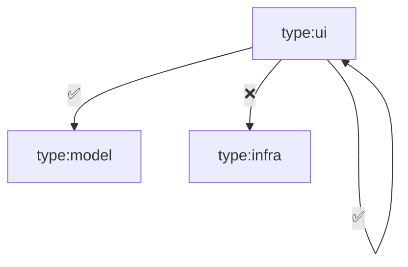
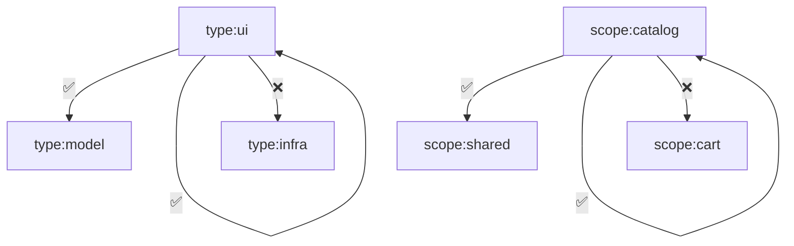
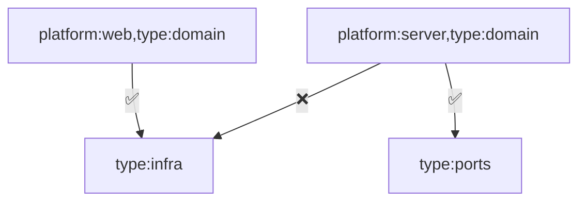

# Enforce Boundaries

Once you [have established the organization of your workspace and libraries](./02-organize-libs.md), and the underlying rules, you will probably want to enforce them.

As a matter of fact, even with the best intentions, it is easy to break the rules we've defined even with a small team and workspace, let alone with a larger team and/or workspace.

## The `@nx/enforce-module-boundaries` eslint rule

Here is where the [Nx eslint plugin](https://nx.dev/nx-api/eslint-plugin) _(`@nx/eslint-plugin`)_ comes into play. More precisely, the `depConstraints` option of the [`@nx/enforce-module-boundaries` rule](https://nx.dev/nx-api/eslint-plugin/documents/enforce-module-boundaries) allows you to enforce the boundaries you have defined for your workspace. For instance, this will analyze the "imports" in your workspace and prevent you from importing a library from another library that isn't supposed to depend on it.

The `depConstraints` option is a list of constraints that define which projects can depend on which other projects. These constraints are tag-based, hence the need to [tag your libraries first](./02-organize-libs.md#tags-and-categories).

## Defining a Constraint

Let's start with a constraint example. The following constraint will allow libraries with the `type:ui` tag to **only** depend on libraries with either the `type:ui` or `type:model` tags:



```json
"depConstraints": [
  {
    "sourceTag": "type:ui",
    "onlyDependOnLibsWithTags": ["type:ui", "type:model"]
  }
],
```

This means that given the following code _(a library with `type:ui` depending on a library with `type:infra`)_:

```ts
// libs/catalog/ui/index.ts
import { RecipeRepository } from '@marmicode/catalog/infra';
```

the eslint rule will produce the following error:

```sh
libs/catalog/ui/index.ts
1:1  error  A project tagged with "type:ui" can only depend on libs tagged with "type:ui", "type:model"  @nx/enforce-module-boundaries

✖ 1 problem (1 error, 0 warnings)
```

:::info
Note that if a project doesn't match any constraint _(i.e. `sourceTag`)_, the default behavior is to produce the following error:

```sh
1:1  error  A project without tags matching at least one constraint cannot depend on any libraries  @nx/enforce-module-boundaries

✖ 1 problem (1 error, 0 warnings)
```

_While this behavior can be overriden by adding a passthrough constraint: `{"sourceTag": "*", "onlyDependOnLibsWithTags": ["*"]}`, we **do not recommend** it as it could hide both configuration errors and constraints violations._
:::

### Circular Dependencies

In the example above, allowing `type:ui` to depend on `type:ui` might look like a circular dependency. However, it is not the case because we are defining a rule for a category of libraries, not a specific library. This means that a library with `type:ui` can depend on another library with `type:ui`.

If you end up with a circular dependency between your libraries, the eslint rule will catch it and produce an error like the following:

```sh
libs/catalog/search-ui/index.ts
1:1  error  Circular dependency between "catalog-search-ui" and "catalog-recipe-ui" detected: catalog-search-ui -> catalog-recipe-ui -> catalog-search-ui
```

## Cumulative Constraints

As presented in the [previous chapter](./02-organize-libs.md#tags-and-categories), it is possible to assign multiple tags to a library, each representing a different dimension _(e.g. `scope:catalog`, `type:ui`)_.

As **the eslint rule will check that all constraints matching the `sourceTag` are met**, you can define multi-dimensional constraints by adding multiple constraints with the `sourceTag` for each dimension.

As an example, the following constraints will allow libraries with the `type:ui` tag to only depend on libraries with either the `type:ui` or `type:model` tags, and libraries with the `scope:catalog` tag to only depend on libraries with either the `scope:catalog` or `scope:shared` tags:



```json
"depConstraints": [
  {
    "sourceTag": "scope:catalog",
    "onlyDependOnLibsWithTags": ["scope:catalog", "scope:shared"]
  },
  {
    "sourceTag": "type:ui",
    "onlyDependOnLibsWithTags": ["type:ui", "type:model"]
  }
],
```

## Multi-Dimensional Constraints

Sometimes, you may want to define constraints that depend on multiple dimensions _(e.g. `platform` + `type`)_.

A typical example is when the frontend and backend have different architecture styles _(e.g. [layered](./02-organize-libs.md#modular-layered-architecture) for the frontend and [hexagonal](./02-organize-libs.md#hexagonal-inspired-architecture) for the backend)_. In this case, the frontend's `domain` layer can depend on the `infra` layer while the backend's `domain` layer cannot.

To put this differently, the `type:domain` category has different rules depending on the category of the `platform` dimension.

Luckily, the `@nx/enforce-module-boundaries` rule supports multi-dimensional constraints that you can define using the `allSourceTags` option, and this is how you can define the previous example:



```json
"depConstraints": [
  {
    "allSourceTags": ["platform:web", "type:domain"],
    "onlyDependOnLibsWithTags": ["type:domain", "type:infra"]
  },
  {
    "allSourceTags": ["platform:server", "type:domain"],
    "onlyDependOnLibsWithTags": ["type:domain", "type:ports"]
  }
],
```

:::note
The diagram above is simplified for the sake of clarity.
:::

## Constraining External Dependencies

After defining constraints between your apps and libraries, you may want to enforce constraints between your workspace and external dependencies (e.g. npm packages).

Here are some common use cases:

- Preventing applications from mistakenly using an external dependency from another framework or platform _(e.g. importing `Injectable` from `@angular/core` in a NestJS application)_.
- Preventing applications from using framework features that you want to avoid in your workspace.
- Preventing libraries from directly importing 3rd party libraries when there is an adapter that wraps them.
- Preventing "non-legacy" libraries from using "legacy" external dependencies.
- Preventing some library types from using any external dependencies _(e.g. `model` library type)_.

This can be achieved using the `allowedExternalImports` _(external dependencies whitelisting)_ and `bannedExternalImports` _(external dependencies blacklisting)_ options.

Here is an example of how to only allow server libraries with the `infra` type to use [Prisma](https://www.prisma.io/) and web libraries with the `infra` type to use Angular's HTTP Client:

```json
"depConstraints": [
  {
    "allSourceTags": ["platform:server", "type:infra"],
    "allowedExternalImports": ["@prisma/client"]
  },
  {
    "allSourceTags": ["platform:web", "type:infra"],
    "allowedExternalImports": ["@angular/common/http"]
  },
],
```

:::tip Prefer `allowedExternalImports`
While `bannedExternalImports` might sound easier to adopt, it is actually more complex to maintain and more error-prone. Our observation is that using a whitelist approach is more sustainable as it will:

- prevent unwanted external imports before they proliferate in your codebase,
- whitelist framework features that are allowed to be used in your workspace,
- encourage developers to think about the external dependencies they are using,
- simplify external dependencies audit and review,
- pinpoint library types that are using too many external dependencies,
- be less likely to turn into a "whack-a-mole" game than you might think.

  :::

## A Complete Example

Here is an example of module boundaries configuration for an crossplatform workspace using a [Modular Layered Architecture](./02-organize-libs.md#modular-layered-architecture):

```json
// .eslintrc.json
{
  "root": true,
  "plugins": ["@nx", ...],
  "overrides": [
    {
      "files": ["*.ts", "*.tsx", "*.js", "*.jsx"],
      "rules": {
        "@nx/enforce-module-boundaries": [
          "error",
          {
            "enforceBuildableLibDependency": true,
            "allow": [],
            "depConstraints": [
              {
                "sourceTag": "platform:web",
                "onlyDependOnLibsWithTags": ["platform:web", "platform:crossplatform"]
              },
              {
                "sourceTag": "platform:server",
                "onlyDependOnLibsWithTags": ["platform:server", "platform:crossplatform"]
              },
              {
                "sourceTag": "platform:crossplatform",
                "onlyDependOnLibsWithTags": ["platform:crossplatform"]
              },
              {
                "sourceTag": "scope:cart",
                "onlyDependOnLibsWithTags": ["scope:cart", "scope:shared"]
              },
              {
                "sourceTag": "scope:catalog",
                "onlyDependOnLibsWithTags": ["scope:catalog", "scope:shared"]
              },
              {
                "sourceTag": "type:app",
                "onlyDependOnLibsWithTags": ["type:feature", "type:ui", "type:domain", "type:infra", "type:model", "type:util"]
              },
              {
                "sourceTag": "type:feature",
                "onlyDependOnLibsWithTags": ["type:feature", "type:ui", "type:domain", "type:infra", "type:model", "type:util"]
              },
              {
                "sourceTag": "type:ui",
                "onlyDependOnLibsWithTags": ["type:ui", "type:model", "type:util"]
              },
              {
                "sourceTag": "type:domain",
                "onlyDependOnLibsWithTags": ["type:domain", "type:infra", "type:model", "type:util"]
              },
              {
                "sourceTag": "type:infra",
                "onlyDependOnLibsWithTags": ["type:infra", "type:model", "type:util"]
              },
              {
                "sourceTag": "type:model",
                "onlyDependOnLibsWithTags": ["type:model", "type:util"]
              },
              {
                "sourceTag": "type:util",
                "onlyDependOnLibsWithTags": ["type:util"]
              },
              {
                "allSourceTags": ["platform:web", "type:app"],
                "allowedExternalImports": ["@angular/*"]
              },
              {
                "allSourceTags": ["platform:web", "type:feature"],
                "allowedExternalImports": ["@angular/*"]
              },
              {
                "allSourceTags": ["platform:web", "type:ui"],
                "allowedExternalImports": ["@angular/core", "@angular/common", "@angular/material"]
              },
              {
                "allSourceTags": ["platform:web", "type:domain"],
                "allowedExternalImports": ["@angular/core"]
              },
              {
                "allSourceTags": ["platform:web", "type:infra"],
                "allowedExternalImports": ["@angular/core", "@angular/common/http"]
              },
              {
                "allSourceTags": ["platform:web", "type:model"],
                "allowedExternalImports": []
              },
              {
                "allSourceTags": ["platform:web", "type:util"],
                "allowedExternalImports": ["date-fns"]
              },
              {
                "allSourceTags": ["platform:server", "type:app"],
                "allowedExternalImports": ["@nestjs/core", "@nestjs/common", "@nestjs/testing"]
              },
              {
                "allSourceTags": ["platform:server", "type:feature"],
                "allowedExternalImports": ["@nestjs/core", "@nestjs/common", "@nestjs/testing"]
              },
              {
                "allSourceTags": ["platform:server", "type:domain"],
                "allowedExternalImports": ["@nestjs/core"]
              },
              {
                "allSourceTags": ["platform:server", "type:infra"],
                "allowedExternalImports": ["@nestjs/core", "@prisma/client"]
              },
              {
                "allSourceTags": ["platform:server", "type:model"],
                "allowedExternalImports": []
              },
              {
                "allSourceTags": ["platform:server", "type:util"],
                "allowedExternalImports": []
              },
            ]
          }
      }
    }
  ]
}
```
