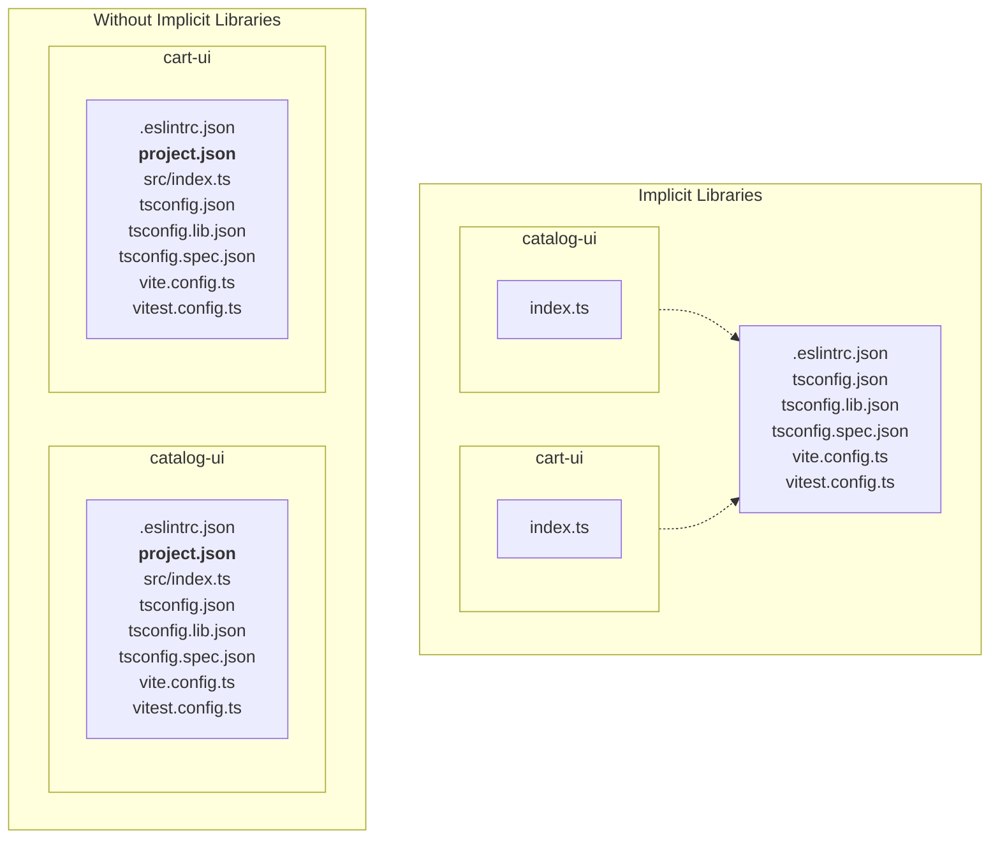

import Tabs from '@theme/Tabs';
import TabItem from '@theme/TabItem';

# Implicit Libraries

## Project Crystal

Since version 18 _(and actually a little before that)_, Nx has been able to infer tasks based on the project structure. This means that Nx plugins can automagically add new targets _(e.g. implicitly add a `test` target with the right configuration when it detects a Vitest configuration file)_. This is called [Project Crystal](https://nx.dev/concepts/inferred-tasks).

## Implicit Libraries

Implicit Libraries are a way to leverage Project Crystal to **make an Nx library nothing more than a new folder in your workspace with an `index.ts` file at its root**.



Here is an example of what a workspace looks like with Implicit Libraries compared to Explicit Libraries.

<Tabs>
  <TabItem value="explicit-libs" label="Explicit Libs" default>

```
libs
└── web
    ├── cart
    │   └── ui
    │       ├── .eslintrc.json
    │       ├── README.md
    │       ├── project.json
    │       ├── src
    │       │   ├── index.ts
    │       │   └── lib
    │       │       ├── cart.spec.ts
    │       │       └── cart.ts
    │       ├── tsconfig.json
    │       ├── tsconfig.lib.json
    │       ├── tsconfig.spec.json
    │       ├── vite.config.ts
    │       └── vitest.config.ts
    └── catalog
        └── ui
            ├── .eslintrc.json
            ├── README.md
            ├── project.json
            ├── src
            │   ├── index.ts
            │   └── lib
            │       ├── catalog.spec.ts
            │       └── catalog.ts
            ├── tsconfig.json
            ├── tsconfig.lib.json
            ├── tsconfig.spec.json
            ├── vite.config.ts
            └── vitest.config.ts
```

  </TabItem>
  <TabItem value="implicit-libs" label="Implicit Libs">

```
libs
└── web
    ├── .eslintrc.json
    ├── cart
    │   └── ui
    │       ├── README.md
    │       ├── cart.spec.ts
    │       ├── cart.ts
    │       └── index.ts
    ├── catalog
    │   └── ui
    │       ├── README.md
    │       ├── catalog.spec.ts
    │       ├── catalog.ts
    │       └── index.ts
    ├── tsconfig.json
    ├── tsconfig.lib.json
    ├── tsconfig.spec.json
    └── vite.config.ts
```

  </TabItem>
</Tabs>
## The Boilerplate Problem

A common drawback when creating libraries is the boilerplate. Even though they are generally generated and taken care of by Nx _(using [generators](../06-glossary.md#generators) and [migrations](../06-glossary.md#migration))_, it can clutter the workspace and add some cognitive load.

Here is a typical non-buildable library structure:

```sh
libs/web/catalog/ui
├── .eslintrc.json
├── README.md
├── project.json
├── src
│   ├── index.ts
│   ├── lib
│   │   ├── my-lib.spec.ts
│   │   └── my-lib.ts
│   └── test-setup.ts
├── tsconfig.json
├── tsconfig.lib.json
├── tsconfig.spec.json
└── vite.config.ts
```

## Step 1: Shared Configuration Files

You will notice that many libraries share similar configuration files. The similarities are often per platform, but there could be other groupings.

Interestingly, most tools provide options that allow us to target specific folders and files _(e.g. `eslint [dir]`, `vitest --root [dir]`, ...)_. This means that we could provide configurations that are shared by multiple libraries but use different options to target specific libraries.

For example, if you [group your libraries per platform](./02-organize-libs.md#file-structure), you could move the configuration files to the common platform folder:

```sh
libs/web
# highlight-next-line
├── .eslintrc.json    👈
├── catalog/ui
│   ├── README.md
│   ├── project.json
│   └── src
│       ├── index.ts
│       └── lib
│           ├── catalog.spec.ts
│           └── catalog.ts
├── cart/ui
│   ├── README.md
│   ├── project.json
│   └── src
│       ├── index.ts
│       └── lib
│           ├── cart.spec.ts
│           └── cart.ts
# highlight-start
├── tsconfig.json      👈
├── tsconfig.lib.json  👈
├── tsconfig.spec.json 👈
└── vite.config.ts     👈
# highlight-end
```

You will need to mainly adjust the paths in the configuration files. Here are some examples:

```diff title=".eslintrc.json"
- "extends": ["../../../.eslintrc.json"],
+ "extends": ["../../.eslintrc.json"]
```

```diff title="tsconfig*.json"
-  "extends": "../../../tsconfig.base.json",
+  "extends": "../../tsconfig.base.json",

- "exclude": ["./vite.config.ts", "src/**/*.spec.ts", "src/**/*.test.ts"]
+ "exclude": ["./vite.config.ts", "**/*.spec.ts", "**/*.test.ts"]
```

:::tip tip: some plugins will still add targets when `project.json` is found
If you enabled the `@nx/eslint` plugin _(`plugins: ["@nx/eslint/plugin"]` in `nx.json`)_, the `lint` target will be added to both libraries even if there is no eslint configuration file in the library.  
:::

While we could add a `test` target to each library as shown below, this would defeat the purpose of implicit libraries.

```ts title="project.json"
"targets": {
  "test": {
    "command": "vitest",
    "options": {
      "cwd": "{projectRoot}",
      "root": "."
    }
  }
}
```

## Step 2: Implicit Library Inference

Thanks to Project Crystal, not only can we infer the targets we need _(e.g. `test`)_ but we can also infer the libraries themselves. This means that we can remove all libraries' project configurations _(i.e. `project.json`)_ and infer them dynamically.

First, you can prepare and simplify the workspace by:

- removing `project.json` files from your libraries,
- flattening the libraries content,
- updating the `tsconfig.base.json` to point to the right paths (e.g. `libs/my-lib/src/index.ts` => `libs/my-lib/index.ts`).

```diff title="tsconfig.base.json"
{
  "compilerOptions": {
    "baseUrl": ".",
    "paths": {
-      "@marmicode/web-catalog-search-ui": ["libs/web/catalog/search-ui/src/index.ts"],
+      "@marmicode/web-catalog-search-ui": ["libs/web/catalog/search-ui/index.ts"],
    }
  }
}

```

The workspace would look something like this:

```sh
libs/web
├── .eslintrc.json
├── catalog/ui
│   ├── README.md
# highlight-start
│   ├── index.ts        👈
│   ├── catalog.spec.ts 👈
│   └── catalog.ts      👈
# highlight-end
├── cart/ui
│   ├── README.md
# highlight-start
│   ├── index.ts        👈
│   ├── cart.spec.ts    👈
│   └── cart.ts         👈
# highlight-end
├── tsconfig.json
├── tsconfig.lib.json
├── tsconfig.spec.json
└── vite.config.ts
```

Now, you can create a workspace plugin that will add the libraries to the Nx graph.

```ts title="tools/plugins/implicit-libs.ts"
import { CreateNodes } from '@nx/devkit';

export const createNodes: CreateNodes = [
  /* This will look for all `index.ts` files that follow your file structure convention. */
  'libs/*/*/*/index.ts',
  (indexPath: string) => {
    const [libs, platform, scope, name] = indexPath.split('/');
    const projectRoot = `${libs}/${platform}/${scope}/${name}`;
    const projectName = `${platform}-${scope}-${name}`;

    return {
      projects: {
        /* This will add a project to the Nx graph for the detected library. */
        [projectRoot]: {
          name: projectName,
          projectType: 'library',
        },
      },
    };
  },
];
```

:::tip tip: debugging the plugin
You can easily debug the plugin by disabling the Nx daemon and running the plugin directly.

```sh
NX_DAEMON=false NX_PERF_LOGGING=true nx show projects
```

:::

Once you enable the plugin by adding it to your plugins in the `nx.json` file, you should see the libraries in the Nx graph.

```json title="nx.json"
{
  "plugins": ["./tools/plugins/implicit-libs.ts"]
}
```

```sh
$ nx show projects

web-catalog-ui
web-cart-ui
```

## Step 3: Add Targets to the Implicit Libraries

As we removed the `project.json` files, Nx plugins will not add any targets to the libraries. We have to adapt our plugin to add the targets we need.

```ts title="tools/plugins/implicit-libs.ts"
export const createNodes: CreateNodes = [
  'libs/*/*/*/index.ts',
  (indexPath: string) => {
    // ...
    return {
      projects: {
        [projectRoot]: {
          name: projectName,
          projectType: 'library',
          // highlight-start
          targets: {
            lint: {
              command: 'eslint .',
              options: {
                cwd: projectRoot,
              },
            },
            test: {
              command: 'vitest',
              options: {
                cwd: projectRoot,
                root: '.',
              },
            },
          },
          // highlight-end
        },
      },
    };
  },
];
```

:::info
Note that while we could technically hide the configuration files (e.g., `.eslintrc.json`, `tsconfig*.json`, `vite.config.ts`, etc.), doing so would break IDE support and other tools or plugins that rely on these files.
:::

## Step 4: Configure Caching

While the example above is a good start, it is still missing the caching configuration, but here is the good news: you can also infer the caching configuration.

```ts title="tools/plugins/implicit-libs.ts"
export const createNodes: CreateNodes = [
  'libs/*/*/*/index.ts',
  (indexPath: string) => {
    // ...

    return {
      projects: {
        [projectRoot]: {
          // ...
          targets: {
            lint: {
              command: 'eslint .',
              // ...
              // highlight-start
              cache: true,
              inputs: [
                'default',
                '^default',
                '{workspaceRoot}/.eslintrc.json',
                `{workspaceRoot}/${libs}/${platform}/.eslintrc.json`,
                '{workspaceRoot}/tools/eslint-rules/**/*',
                {
                  externalDependencies: ['eslint'],
                },
              ],
              outputs: ['{options.outputFile}'],
              // highlight-end
            },
            test: {
              command: 'vitest',
              // ...
              // highlight-start
              cache: true,
              inputs: [
                'default',
                '^production',
                {
                  externalDependencies: ['vitest'],
                },
                {
                  env: 'CI',
                },
              ],
              outputs: [`{workspaceRoot}/coverage/${libs}/${platform}/${name}`],
              // highlight-end
            },
          },
        },
      },
    };
  },
];
```

:::tip tip: where did the cache configuration come from?
As of today, there is no simple way of reusing Nx plugins logic in your own plugins.

A quick workaround is to give a look a the inferred project configuration before moving to implicit libraries _(or using a sample Nx workspace)_:

```sh
nx show project my-lib --json | jq .targets.test
```

Otherwise, Nx plugins source code is a good source of inspiration
_(e.g. [@nx/eslint](https://github.com/nrwl/nx/blob/master/packages/eslint/src/plugins/plugin.ts) or [@nx/vite](https://github.com/nrwl/nx/blob/master/packages/vite/src/plugins/plugin.ts))_.
:::

## Step 5: Tag the Implicit Libraries

Finally, you can let the plugin tag the libraries based on the file structure convention.

```ts title="tools/plugins/implicit-libs.ts"
export const createNodes: CreateNodes = [
  'libs/*/*/*/index.ts',
  (indexPath: string) => {
    // ...

    return {
      projects: {
        [projectRoot]: {
          // ...
          // highlight-next-line
          tags: [`platform:${platform}`, `scope:${scope}`, `type:${type}`],
        },
      },
    };
  },
];
```

## Step 6: Add Libraries

You can now add new libraries by creating a new folder with an `index.ts` file following the file structure convention implemented in the Implicit Libraries plugin.

```
libs/
└── web                     👈 platform
    └── catalog             👈 scope
        └── search-feature  👈 name-type (or just type)
            └── index.ts
```

Then you can add the new library to the `tsconfig.base.json` paths.

```diff title="tsconfig.base.json"
{
  "compilerOptions": {
    "paths": {
      ...
+      "@marmicode/web-catalog-search-feature": ["libs/web/catalog/search-feature/index.ts"]
    }
  }
}
```

While Implicit Libraries make library generators less useful, implementing a generator could still be useful to:

- make sure that libraries are created with the right structure and categories,
- update the `tsconfig.base.json` paths,
- update the `.eslintrc.json` with new boundaries when a library is using a new scope.

## Full Plugin Example

Here is the full plugin example:

```ts title="tools/plugins/implicit-libs.ts"
import { CreateNodes } from '@nx/devkit';

export const createNodes: CreateNodes = [
  'libs/*/*/*/index.ts',
  (indexPath: string) => {
    const [libs, platform, scope, name] = indexPath.split('/');
    const projectRoot = `${libs}/${platform}/${scope}/${name}`;
    const projectName = `${platform}-${scope}-${name}`;
    const nameParts = name.split('-');
    const type = nameParts.at(-1);

    return {
      projects: {
        [projectRoot]: {
          name: projectName,
          projectType: 'library',
          tags: [`platform:${platform}`, `scope:${scope}`, `type:${type}`],
          targets: {
            lint: {
              command: 'eslint .',
              options: {
                cwd: projectRoot,
              },
              cache: true,
              inputs: [
                'default',
                '^default',
                '{workspaceRoot}/.eslintrc.json',
                `{workspaceRoot}/${libs}/${platform}/.eslintrc.json`,
                '{workspaceRoot}/tools/eslint-rules/**/*',
                {
                  externalDependencies: ['eslint'],
                },
              ],
              outputs: ['{options.outputFile}'],
            },
            test: {
              command: 'vitest',
              options: {
                cwd: projectRoot,
                root: '.',
              },
              cache: true,
              inputs: [
                'default',
                '^production',
                {
                  externalDependencies: ['vitest'],
                },
                {
                  env: 'CI',
                },
              ],
              outputs: [`{workspaceRoot}/coverage/${libs}/${platform}/${name}`],
            },
          },
        },
      },
    };
  },
];
```

:::warning
Note that this is a simplified example. You might need to adjust it to your needs.
You can find a more complete example on the [Cookbook Demos repository](https://github.com/marmicode/cookbook-demos/tree/nx-implicit-libs/tools/plugins/implicit-libs.ts).
:::

## When to use Implicit Libraries?

While implicit libraries can be a powerful way to:

- 👍 **simplify** your workspace,
- 👍 **get more control** over the configuration,
- 👍 **share configuration** files,
- 👍 ensure that the workspace is **highly aligned with the architecture style and the file structure convention**,

they come with some drawbacks like:

- 🫤 having to **implement plugins**,
- 🫤 and **losing Nx builtin plugins inference**.

:::info
That is why our general recommendation is to mainly use Implicit Libraries for **non-buildable libraries**.
:::

:::tip tip: Implicit Libraries encourage modular architectures
From what we observed, the amount of boilerplate generated by libraries tends to discourage teams from creating additional libraries.
Implicit Libraries can help teams create more libraries and easily maintain them, leading to a more modular architecture.
:::

## Source Code

- 💻 [**Implicit Libs Plugin Example** by Marmicode](https://github.com/marmicode/cookbook-demos/tree/nx-implicit-libs/tools/plugins/implicit-libs.ts)

## Additional Resources

- 📝 [**Inferred Tasks** by Nx](https://nx.dev/concepts/inferred-tasks)
- 📝 [**Extending the Project Graph** of Nx by Nx](https://nx.dev/extending-nx/recipes/project-graph-plugins)
- 📝 [**Discovering Nx Project Crystal Magic** by Jonathan Gelin](https://jgelin.medium.com/discovering-nx-project-crystals-magic-7f42faf2a135)
- 📺 [**Project Crystal** by Nx](https://youtu.be/wADNsVItnsM)
